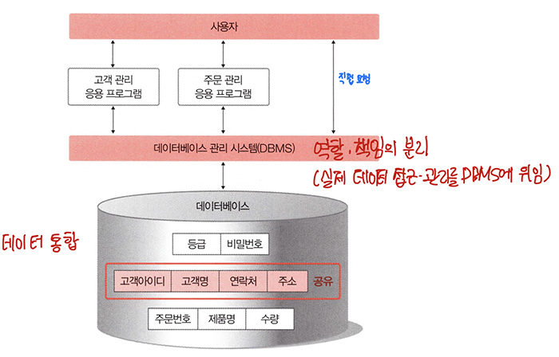

# <a href = "../README.md" target="_blank">데이터베이스 개론</a>
## Chapter 02. 데이터베이스 관리 시스템
### 2.2 데이터베이스 관리 시스템의 정의
1) 데이터베이스 관리 시스템(DataBase Management System)
2) 데이터 통합관리
3) 데이터 독립성 확보
4) 데이터베이스의 주요 기능

---

# 2.2 데이터베이스 관리 시스템의 정의

## 1) 데이터베이스 관리 시스템(DataBase Management System)
조직에 필요한 데이터를 데이터베이스에 통합하여 저장하고, 이에 대한 관리를 집중적으로 담당하는 소프트웨어.
- 응용 프로그램들을 대신하여 데이터를 삽입,삭제,수정,검색(CRUD)
- 통합 데이터 관리 : 모든 응용 프로그램이 데이터베이스를 공유
- 파일 시스템의 한계점이였던 데이터 중복성, 데이터 종속성 문제를 해결

---

## 2) 데이터 통합관리
데이터를 한 곳에 통합하여 관리하므로, 중복성으로 인한 문제가 해결됨
- 저장공간 낭비의 문제 사라짐
- 한 곳에 통합되므로 데이터 일관성, 데이터 무결성을 유지하기 쉬워짐

---

## 3) 데이터 독립성 확보
DBMS 자체에서 데이터 생성, 접근, 갱신 등의 기능을 모두 관리함  
- 데이터 관련 작업을 사용자 또는 어플리케이션에서 하지 않아도 됨. 그저 DBMS에게 요청만 하면 된다.
- 데이터베이스 내적인 물리구조 및 접근방식이 변경되어도, 이에 대해 사용자, 어플리케이션에서 굳이 알지 않아도 됨.

---

## 4) 데이터베이스의 주요 기능
1. 데이터 정의(Data Definition)
   - 데이터를 저장하기 적합한 데이터베이스 구조를 정의할 수 있음.
   - 이미 정의된 데이터베이스 구조를 수정 가능

2. 데이터 조작(Data Manipulation) : CRUD
   - 데이터에 저장된 데이터에 접근하여 사용할 수 있는 기능 제공
   - 데이터를 삽입(Create), 검색(Read), 수정(Update), 삭제(Delete)하는 연산을 효율적으로 처리

3. 데이터 제어(Data Control) : 데이터베이스를 여러 사용자가 공유해도 항상 정확하고 안전하게 유지
   - 데이터 일관성, 무결성 유지 : CRUD 연산을 한 뒤에도 내용이 일관되면서 무결성을 유지하게 함.
   - 장애대응, 회복 : 장애가 발생해도 기능이 회복가능하도록 제저
   - 보안 : 권한이 있는 사용자에게만 데이터 접근을 허용
   - 동시성 : 여러 사용자가 데이터를 동시에 접근하여 데이터를 처리할 수 있도록 제어

---