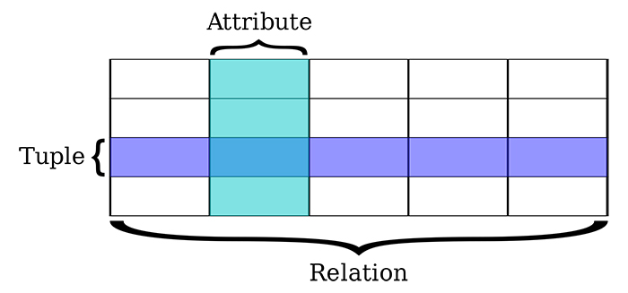

# <a href = "../README.md" target="_blank">데이터베이스 개론</a>
## Chapter 05. 관계 데이터 모델
### 5.1 관계 데이터 모델
1) 관계 데이터 모델의 기본 용어
2) 릴레이션과 데이터베이스의 구성
3) 릴레이션의 특성
4) 키의 종류

---

# 5.1 관계 데이터 모델

## 1) 관계 데이터 모델의 기본 용어

### 릴레이션
- 한 개체에 대한 관한 데이터를, 2차원 테이블의 구조로 저장한 것.

### 1.1> 속성(Attribute)
- 릴레이션의 열(column)
- 각 속성을 서로 다른 이름을 이용해 구별.
- 파일 관리 시스템에서 : 릴레이션을 파일이라 했을 때, 필드(Field)에 대응하는 개념

### 1.2> 투플(Tuple)
- 릴레이션의 행(row)
- 하나의 투플은, 하나의 개체 인스턴스에 해당
- 파일 관리 시스템에서의 레코드(record)에 대응하는 개념

### 1.3> 도메인(domain)
- 속성 하나가 가질 수 있는 모든 값들의 집합
- 일반적으로 도메인은 가능한 값을 일일이 나열하기 어려운 경우가 대부분이라, 속성의 특성을 고려한 데이터 타입으로 정의
  - 예) 이름 속성의 도메인을 CHAR(20), 나이 속성의 도메인을 INT로 정의하기
- 프로그래밍 언어에서 : 도메인 - 데이터타입, 속성 - 변수
  - 특정 데이터 타입으로 정의한 변수에는 해당 데이터 타입의 값만 저장할 수 있음.
  - 도메인을 정하면 해당 도메인에 속하는 속성값만 저장할 수 있음.

### 1.4> 널 값(null)
- 특정 투플의 속성값에 대하여 값을 모르거나, 적합한 값이 없는 경우 `null`을 사용
- null은 없음을 의미. 0이나 공백문자와 다르다!

### 1.5> 차수(degree)
- 한 릴레이션에서 속성의 전체 개수
- 일반적으로 자주 변하지 않는 정적인 특징이 있음

### 1.6> 카디널리티(cardinality)
- 한 릴레이션에서 투플 전체의 개수
- 투플이 없는 릴레이션이 존재할 수 있음
- 새로 투플이 삽입되거나, 기존 투플이 삭제될 수 있으므로 자주 변하는 동적인 특징이 있음.

---

## 2) 릴레이션과 데이터베이스의 구성

릴레이션 = 릴레이션 스키마 + 릴레이션 인스턴스

### 2.1> 릴레이션 스키마(Relation Schema)
> 릴레이션이름(속성이름1, 속성이름2, 속성이름3, ... , 속성이름n) 
- 릴레이션의 이름과 릴레이션에 포함된 모든 속성의 이름으로 정의하는 논리적 구조
- 릴레이션의 이름이 무엇인지, 릴레이션을 구성하고 있는 속성들은 무엇인지 쉽게 파악할 수 있음
- 릴레이션 내포(Relation Intension)라고도 부름.
- 구조는 자주 바뀌지 않다보니 릴레이션 스키마는 자주 변하지 않는 정적인 특징이 있음

### 2.2> 릴레이션 인스턴스
- 어느 한 시점에, 릴레이션에 존재하는 투플들의 집합
- 현재 릴레이션의 실제 내용값들.
- DBMS는 내부적으로 데이터 조작어(DML)을 이용해 릴레이션 인스턴스의 투플들에 대한 CRUD를 수행함.
- 간단히 릴레이션이라고 부르기도 하고, 릴레이션 외연(Relation extension)이라고도 부름.
- 실제 내부값은 자주 변경되기 때문에, 릴레이션 인스턴스는 자주 변경되는 동적인 특징이 있음

### 2.3> 데이터베이스 스키마와 데이터베이스 인스턴스

데이터베이스는 릴레이션 여러개로 구성
1. 데이터베이스 스키마
   - 릴레이션 스키마들의 모음
   - 데이터베이스 스키마의 설계는 즉, 필요한 모든 릴레이션들의 스키마를 모두 정의하는 것

2. 데이터베이스 인스턴스
   - 릴레이션 인스턴스의 모음
   - 어느 한 시점에서 데이터베이스에 저장된 데이터의 전체 집합
   - 데이터베이스를 구성하는 모든 릴레이션의 인스턴스를 모아둔 것

---

## 3) 릴레이션의 특성

### 3.1> 투플의 유일성 : 하나의 릴레이션에는 동일한 투플이 존재할 수 없다.
### 3.2> 투플의 무순서 : 하나의 릴레이션에서 투플 사이의 순서는 무의미하다.
### 3.3> 속성의 무순서 : 하나의 릴레이션에서 속성 사이의 순서는 무의미하다.
### 3.4> 속성의 원자성 : 속성 값으로 원자 값만 사용할 수 있다.

---

## 4) 키의 종류

### 4.1> 슈퍼키
### 4.2> 후보키
### 4.3> 기본키(Primary Key)
### 4.4> 대체키
### 4.5> 외래키(Foreign Key)

---