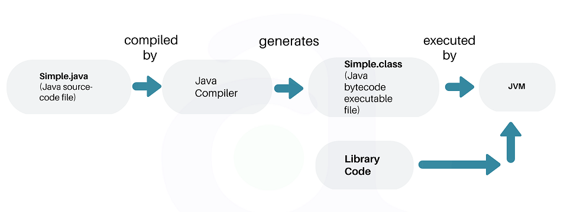

## <a href = "../README.md" target="_blank">스프링 입문을 위한 자바 객체 지향의 원리와 이해</a>

### Chpater 2. 자바와 절차적, 구조적 프로그래밍
#### 2.01 자바 프로그램의 개발과 구동
1) JDK, JRE, JVM
2) Java 어플리케이션 작성하기
3) Java 컴파일
4) Java 어플리케이션의 실행
5) JVM의 대략적인 구조
6) JVM Memory Areas
---

# 2.01 자바 프로그램의 개발과 구동

## 1) JDK, JRE, JVM

1. JDK (Java Development Kit, 자바 개발 도구) : 자바 어플리케이션을 개발하는데 필요한 도구들.
   - JRE(JVM + 클래스 라이브러리) + 개발에 필요한 실행파일 (컴파일러 javac.exe을 비롯한 각종 개발 환경)

2. JRE(Java Runtime Environment, 자바 실행 환경) : 자바로 적용된 응용프로그램이 실행되기 위한 최소의 실행 환경.
   - JVM + 클래스 라이브러리
   - 자바의 코드들은 기본적으로 제공해주는 클래스 라이브러리를 공통분모로 하여 작성되고, JRE가 반드시 설치 되어 있어야 실행이 된다.
   - 실행기인 java.exe를 비롯한 여러가지 요소들이 여기에 포함된다.

3. JVM(Java Virtual Machine, 자바 가상 머신) : 자바를 실행하기 위한 가상 기계.
   - Java 어플리케이션은 JVM에서만 실행되기 때문에, JVM이 반드시 설치되어야한다.

---

## 2) Java 어플리케이션 작성하기
- notepad, 메모장과 같은 단순한 텍스트 편집기를 통해 날코딩을 하거나,
- Eclipse, IntelliJ Idea와 같은 IDE(통합개발환경, Integrated Development Environment)로 java파일 작성
- IntelliJ를 설치할 것을 권장.

---

## 3) Java 컴파일

1. 컴파일 : 어떤 언어로 작성된 코드를 다른 언어로 바꾸는 과정
    - C, C++ 등 고급언어의 컴파일러 : 기계어로 바로 변경. OS마다 다른 기계어 코드를 생성.
    - java : 다양한 플랫폼에서 실행되도록 하기 위해서(OS별 JRE 및 JVM), 중간 언어인 java 바이트코드로 컴파일함.

2. 바이트코드 : 가상머신이 이해할 수 있는 중간코드.

3. `javac.exe` : 인간이 작성한 `.java`파일을 jvm이 이해할 수 있는 바이트 코드로 컴파일
    - 구문체크
    - 소스코드 최적화
    - 생략된 코드 추가
    - 코드파일에 포함된 클래스들을 `.class`로 분리 컴파일

4. JVM에서의 JIT 컴파일
    - 실제 프로그램을 실행하였을 때, JVM의 인터프리터, JIT 컴파일러에 의해 바이트코드를 기계어로 컴파일 후 코드를 실행함.
      https://dzone.com/articles/jvm-architecture-explained
---

## 4) Java 어플리케이션의 실행
- 한 번 `.Class`파일로 컴파일하면, 어느 플랫폼이든 그에 맞게 제공되는 JRE의 자바실행기를 거쳐, JVM 위에서 실행될 수 있다.
    - 이러한 특성을 Write Once, Run Anywhere라고 함.
- `javac.exe` :  각 jre의 자바 실행기. JVM을 구동하여 `.class` 파일을 컴파일
- jvm은 바이트코드를 각 OS에 특화된 코드로 변환(인터프리터, JIT 컴파일러)하여 실행한다.

---

## 5) JVM의 대략적인 구조

JVM은 크게 다음과 같이 구성되어 있는데, 이 책에서는 JVM 메모리 영역을 중점적으로 살펴보고 있다.

1. Class Loader : `.class` 파일의 바이트 코드를 읽고, 메모리에 적재하는 역할
2. JVM Memory Areas : 실제 실행 프로그램 정보가 적재되는 메모리 공간
3. Execute Engine : Memory 영역에 할당된 바이트 코드를 실제 실행하는 영역.
4. Native Method Interface(JNI) : Native Method Area와 상호작용하여, 실행에 필요한 Native Method Libraries를 제공
5. Native Method Libraries : 실제 C, C++로 작성된 라이브러리, 작성 코드

---

## 6) JVM Memory Areas

실제 실행 프로그램 정보가 적재되는 메모리 공간

1. 공유 자원
   - Method Area
      - 클래스로더를 통해 읽어들인 클래스 수준의 정보(클래스 풀네임, 상위 클래스 풀네임, 메서드, 변수, ...)
   - Heap Area
      - 인스턴스 저장. 공유자원
2. 각 쓰레드의 영역(각 쓰레드마다)
   - Stack Area : 메서드 호출 정보를 `Stack Frame`이라는 블럭으로 쌓음. 모든 `StackFrame`이 사라진 쓰레드는 종료된다.
   - PC(Program Counter) Registers : 현재 실행중인 명령(Stack Frame)의 위치를 가리키는 포인터
   - Native Method Stack : native 메서드들의 호출정보가 쌓이는 스택

---

참고자료 : HowToDoInJava - <a href="https://howtodoinjava.com/java/basics/jdk-jre-jvm/" target="_blank">Java JDK, JRE and JVM</a>

---