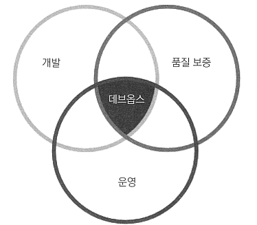

# <a href = "../README.md" target="_blank">배포 자동화와 지속적 인도</a>
## Chapter 01. 지속적 인도 소개
### 1.3 CD의 전제 조건
1) CD 요구사항
2) 조직 구조 - 데브옵스 문화
3) 조직 구조 - 프로세스 내의 고객
4) 조직 구조 - 사업적 의사 결정과 릴리스
5) 기술 및 개발의 전제 조건

---

# 1.3 CD의 전제 조건

---

## 1) CD 요구사항
CD 프로세스를 성공적으로 도입할 수 있는 지 여부는 단순히 기술에만 달려 있지 않다.

- 회사 조직 구조 : 아무리 좋은 의도를 갖고 있다 하더라도 조직 구조의 변경 없이는 개발 팀이
CD 프로세스를 도입할 수 없다.
- 제품 및 기술 세부 정보
- 개발 팀 및 개발 방식

---

## 2) 조직 구조 - 데브옵스 문화

### 2.1 전문화의 폐해
- 개인, 소규모 팀 개발 시기엔 개발-테스트-운영 업무에 명확한 구분이 없었다.
- 시스템이 대형화되고 개발 팀의 규모가 커짐에 따라 개발 방식도 점차 체계적으로 변화했다. 각 엔지니어들도 각 분야에서 전문화되었다.
- 개발-QA-운영 팀이 서로 분리되면서 의사소통 부담이 발생하게 되고 CD 프로세스에 적합하지 않게 됨.

### 2.2 데브 옵스(DevOps)
- 한 사람 또는 한 팀이 개발-QA-운영 세 영역 모두에 책임을 갖는 것
- 자동화 덕분에 QA-운영 관련 대부분의 업무가 자동화된 인도 파이프라인으로 전환되기에, 개발 팀이 충분히 관리할 수 있다.

### 2.3 소프트웨어 아키텍처
- 기능 요구사항은 (마이크로) 서비스나 모듈 단위로 작게 나눠야함
- 분리된 부분을 팀별로 독립적으로 관리할 수 있어야함

---

## 3) 조직 구조 - 프로세스 내의 고객

### 3.1 전통적 고객, 프로덕트 오너의 역할
- 요구사항 작성
- 개발자의 질문에 답하며 시연에 참여
- UAT 단계에 참여해 개발 결과가 마음에 드는지 결정

### 3.2 CD에서 고객, 프로덕트 오너의 역할
- UAT가 없으므로, 인수 테스트 작성 단계에서 고객이 참여하는 것이 중요
- 즉시 테스트 가능한 방식으로 요구 사항을 작성한 고객의 경우 크게 관여할 일이 없지만,
그렇지 않을 경우 기술적으로 잘 작성할 수 있도록 사고의 전환을 유도해야함.

---

## 4) 조직 구조 - 사업적 의사 결정과 릴리스

### 4.1 회사의 사업 부서
- 릴리스 일정을 결정할 때 중요한 역할을 함
- 어떤 기능을 언제 인도할 것인가 결정하는 것은 다른 부서(마케팅 등)와도 관련이 있고, 회사의 중요한 전략이기도 함
- 릴리스 일정을 정할 때는 사업 부서와 개발 부서가 협의해 결정

### 4.2 특정 시기에 릴리스 할 수 있도록 지원하는 기법이 필요
- 회사의 사업 부서 의사에 따라, 특정 시기에 기능을 릴리스할 수 있도록 지원하는 기법들이 존재한다.
- 기능 토글, 수동 파이프 라인 스텝 등이 이에 해당한다.

### 4.3 지속적 배포(Deployment) vs 지속적 인도(Delivery)
- 지속적 배포 : 리포지터리에 코드가 커밋되면 자동으로 프로덕션에 릴리스
- 지속적 인도 : 커밋된 코드가 최종적으로 릴리스 후보가 되는 것. 프로덕션 릴리스를 수동으로 하는 것도 포함된다.

---

## 5) 기술 및 개발의 전제 조건

### 5.1 자동 빌드, 테스트, 패키지, 배포 작업
- 모든 작업을 자동화할 수 있어야한다.
- 보안 문제가 생긴다거나 복잡하다는 이유로 자동화가 불가능한 시스템이 있다면 자동화된 인도 파이프라인을 만드는 것은
불가능하다.

### 5.2 신속한 파이프라인 실행
- 파이프라인은 빠르게, 늦어도 5-15분 내에 실행돼야 한다.
- 파이프라인 실행이 몇 시간, 며칠이 걸린다면 리포지터리에 커밋될 때마다 실행되는 것이 불가능하다.

### 5.3 신속한 장애 복구
- 신속한 롤백이나 복구를 할 수 있어야한다.
- 그렇지 않다면 릴리스를 자주 할 수록 위험도가 높아진다.

### 5.4 무중단 배포
- 하루에도 수 차례 배포를 해야하기 때문에 배포 시 다운타임이 발생하면 안 된다.

### 5.5 트렁크 기반 개발
- 개발자는 정기적으로 마스터 브랜치에 체크인해야 한다.
- 그렇지 않고 개발자들이 자신의 로컬 브랜치에서만 작업하면 코드 통합이 되지 않으므로 릴리스 회수가 줄어든다.
이는 CD가 추구하는 목표라 할 수 없다.

---

