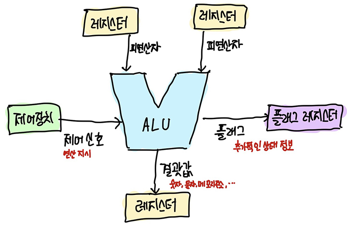
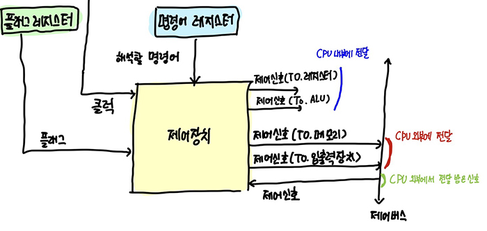

# <a href = "../README.md" target="_blank">혼자 공부하는 컴퓨터 구조 + 운영체제</a>
## Chapter 04. ALU와 제어장치
### 4.1 ALU와 제어장치
1) ALU
2) 제어장치와 제어 신호

---

# 4.1 ALU와 제어장치

- CPU는 크게 ALU, 제어장치, 레지스터로 세 개의 부품으로 구성되어 있음
- 이번 장에서는 ALU, 제어장치에 대해서 다룬다.

---

## 1) ALU

### 1.1 ALU
- 계산만을 위해 존재하는 부품
- 컴퓨터 내부에서 수행되는 대부분의 계산(산술 연산, 논리 연산 등 다양한 연산)은 ALU가 도맡아 수행한다.

### 1.2 ALU의 연산에 필요한 것들
- 피연산자 : 연산에 필요한 데이터. 레지스터로부터 받는다.
- 제어신호 : 수행할 연산에 대한 전기 신호. 제어장치로부터 받는다.

### 1.3 ALU 연산의 결괏값
- 기본적인 결괏값 : 특정 숫자, 문자, 메모리 주소를 반환하는데 이들은 **레지스터**에 저장된다.
    - 메모리에 결괏값을 저장하면 CPU는 메모리에 더 자주 접근하게 되고, 프로그램 실행 속도를 늦추게 되므로 ALU의 연산 결괏값은 1차적으로 레지스터에
      저장한다.
- 플래그 : 연산 결과에 대한 추가적인 정보. 예를 들어 이진수의 연산 결과만 놓고 봤을 때는 이게 양수인지 음수인지 판단하기 힘든데
  이런 추가적인 정보를 제공하기 위해 플래그를 사용한다.

### 1.4 플래그의 종류
플래그는 여러가지 종류가 있고, 대표적으로 다음과 같은 플래그가 있다. 이것들 외에도 여러 플래그가 있다.

1. 부호 플래그
    - 연산한 결과의 부호를 나타냄
    - 예) 부호 플래그가 1인 경우 계산 결과는 음수, 0인 경우 계산 결과는 양수를 의미
2. 제로 플래그
    - 연산 결과가 0인지 여부를 나타냄
    - 예) 제로 플래그가 1인 경우 연산 결과는 0, 0인 경우 연산 결과가 0이 아님을 의미
3. 캐리 플래그
    - 연산 결과, 올림수나 빌림수가 발생했는지를 나타냄
    - 예) 캐리 플래그가 1인 경우 올림수나 버림수가 발생했음을 의미하고, 0인 경우 발생하지 않았음을 의미
4. 오버플로우 플래그
    - 오버플로우가 발생했는 지를 바타냄
    - 예) 오버플로우 플래그가 1인 경우 오버플로우가 발생했음을 의미하고, 0인 경우 발생하지 않았음을 의미
5. 인터럽트 플래그
    - 인터럽트가 가능한지를 나타냄(4-3절에서 다룸)
    - 예) 인터럽트 플래그가 1인 경우 인터럽트가 가능함을 의미, 0인 경우 인터럽트가 불가능함을 의미
6. 슈퍼바이저 플래그
    - 커널 모드로 실행 중인지, 사용자 모드로 실행 중인지를 나타냄(9장에서 다룸)
    - 예) 슈퍼바이저 플래그가 1인 경우 커널 모드로 실행 중임을 의미, 0인 경우 사용자 모드로 실행 중임을 의미

### 1.5 플래그 레지스터

- 플래그들은 플래그 레지스터라는 별도의 레지스터에 저장됨
- 플래그 레지스터에 저장된 플래그를, 제어 장치가 연산 결과 해석에 참고함

### 1.6 그 외
- ALU 내부에는 가산기, 보수기, 시프터, 오버플로우 검출기 등이 있으나 이러한 내용들은 이 책의 범위를 벗어나므로 깊이 다루지 않음
---

## 2) 제어장치와 제어 신호

### 2.1 제어장치
- CPU에서 제어신호를 발생시키고, 명령어를 해석하는 부품
- CPU의 구성 요소 중 가장 정교하게 설계되어 있고, 핵심이라 할 수 있음.
- CPU 제조사마다 제어장치의 구현 방식, 명령어 해석 방식, 받아들이고 내보내는 정보에 조금씩 차이가 있을 수 있다.

### 2.2 제어 신호
- 컴퓨터 부품을 관리하고, 작동시키기 위한 전기 신호
- 주로 CPU의 제어장치가 발생시킴

### 2.3 제어 장치가 받아들이는 정보
1. 클럭신호  
   
   - 클럭 : 컴퓨터의 부품들을 움직이는 시간 단위
   - 클럭 주기에 맞춰, 한 레지스터에서 다른 레지스터로 데이터가 이동되거나, ALU에서 연산이 수행되거나, CPU가 메모리에 저장된 명령어를
     읽을 수 있다.
   - 컴퓨터 부품들은 클럭 박자에 맞춰서 작동할 뿐, 반드시 한 박자마다 작동하지는 않는다. 하나의 명령어가 여러 클럭에 걸쳐 실행될 수도 있다.
2. 해석해야 할 명령어
    - CPU가 해석해야 할 명령어는 '명령어 레지스터'에 저장된다.
    - 제어장치는 명령어 레지스터로부터 해석해야할 명령어를 받아들이고 해석한 뒤, 제어신호를 발생시켜 컴퓨터 부품들에게 수행해야할 내용을 알려준다.
3. 플래그 레지스터 속 플래그 값
   - ALU 연산에 대한 추가적인 상태 정보를 무시할 수 없기 때문에, 제어장치는 플래그 값을 받아들이고 이를 참고하여 제어신호를 발생시킨다.
4. 시스템 버스의 제어버스로 전달된 제어 신호
   - 입출력장치, 보조기억장치를 비롯한 여러가지 CPU 외부 장치도 제어 신호를 발생시킬 수 있다.
   - 외부에서 발생한 제어 신호는 시스템 버스의 제어 버스를 통해 제어 장치에 전달된다.

### 2.4 제어장치가 내보내는 정보
1. CPU 외부 제어 신호
   - CPU 외부에 제어 신호를 보낼 때는 제어버스를 통해 제어신호를 내보냄
   - 메모리 제어 신호 : 메모리에 저장된 값을 읽거나, 메모리에 새로운 값을 쓸 때
   - 입출력 장치(보조기억 장치 포함) : 입출력 장치의 값을 읽거나, 입출력 장치에 새로운 값을 쓸 때
2. CPU 내부 제어신호
   - ALU에 전달하는 제어 신호 : 수행할 연산을 지시
   - 레지스터에 전달하는 제어 신호 : 레지스터 간에 데이터를 이동시키거나, 레지스터에 저장된 명령어를 해석하기 위해 신호 발생

---
