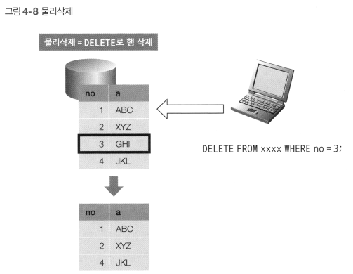
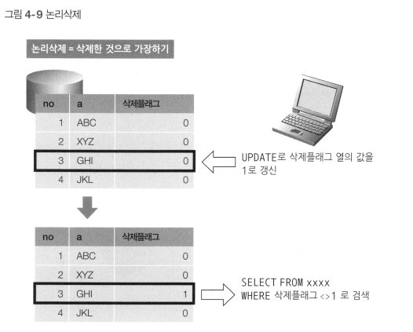

# <a href = "../README.md" target="_blank">SQL 첫걸음</a>

## Chapter 04. 데이터의 추가, 삭제, 갱신

### 19강. 물리삭제와 논리삭제
1) 물리삭제(Hard Delete)
2) 논리삭제(Soft Delete)
3) 삭제 방법 선택
---

# 19강. 물리삭제와 논리삭제

---

## 1) 물리삭제(Hard Delete)

- DELETE 쿼리를 날려서, 실제로 DB에서 데이터를 삭제하는 방법

---

## 2) 논리삭제(Soft Delete)

- 삭제 상태(is_deleted) 칼럼을 하나 만들어두고 그 값을 갱신하는 방식
- 그 외에도 여러 방식이 있긴한데 주로 삭제 상태 칼럼을 사용해 관리
- 데이터를 완전히 삭제하지 않기 때문에 언제든 삭제 전의 상태로 되돌릴 수 있다.
- 단점
  - 삭제해도 데이터베이스 저장공간이 늘어나지 않음
  - 데이터베이스의 크기가 증가함에 따라 검색 속도가 떨어지는 점
  - 실제로 삭제를 할 때 DELETE가 아닌, UPDATE 쿼리를 실행하므로 혼란을 야기할 수 있는 점

---

## 3) 삭제 방법 선택
- 꼭 어느 방식으로 삭제해야한다 정해진 것은 없음. 결국 케바케(Case By Case).
- 예)
  - 회원 탈퇴 후 회원의 민감한 정보를 삭제할 때는 hard delete
  - 고객의 주문 취소 등 금전적인 문제와 관련된 중요한 사항은 기록해두는 것이 유리하므로 soft delete
  - 데이터베이스 용량이 민감하여 절약이 중요한 상황에서 hard delete 고려

---
