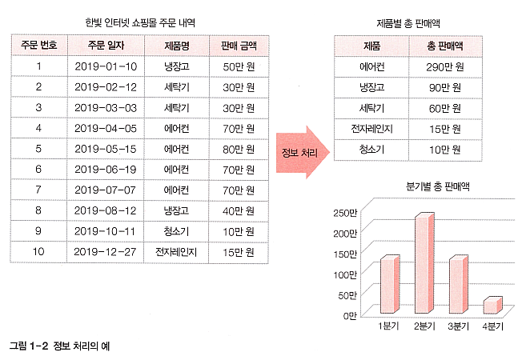
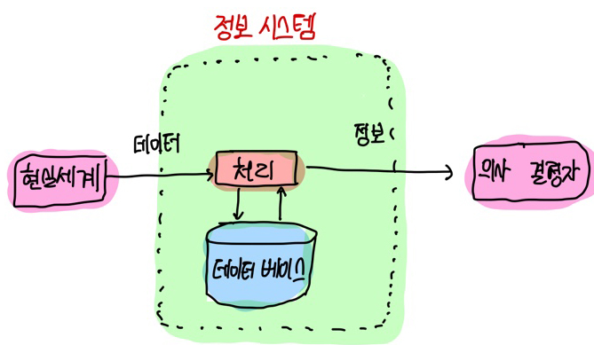

# <a href = "../README.md" target="_blank">데이터베이스 개론</a>

## Chapter 01. 데이터베이스 기본 개념
### 1.1 데이터베이스의 필요성
1) 데이터와 정보
2) 정보 처리
3) 정보 시스템에서 데이터베이스의 중요성

---

# 1.1 데이터베이스의 필요성

---

## 1) 데이터와 정보


### 1.1 데이터(data)
- 현실 세계에서 단순히 관찰하거나 측정하여 수집한 사실(fact)이나 값(value)
- 예) '땃쥐', 2022-11-18, 'ttasjwi', ...

### 1.2 정보(information)
- 데이터를 의사 결정에 유용하게 활용할 수 있도록 처리하여 체계적으로 조직한 결과물
- 데이터에 의미가 부여된 것
- 예) 특정 회원의 이름, 회원의 가입일, 회원의 로그인 아이디, 50살 이상인 회원의 수, ...
  ```json
  {
    "name": "땃쥐",
    "createdDate": "2022-11-18",
    "country": "Korea"
  }
  ```

---

## 2) 정보 처리


### 2.1 정보 처리(Information Processing)
- 데이터에서 정보를 추출하는 과정 또는 방법
- 데이터를 상황에 맞게 분석하거나 해석하여 데이터 간의 관계를 파악하는 것

### 2.2 가치 있는 정보를 얻기 위해 필요한 것
- 유의미한 데이터를 많이 수집하는 것
- **데이터를 효율적 관리할 수 있도록 하는 것** -> 데이터베이스의 역할, 책임

---

## 3) 정보 시스템에서 데이터베이스의 중요성



### 3.1 정보 시스템(Information System)
- 데이터를 수집하여 저장해두었다가, 의사 결정이 필요할 때 처리하여 유용한 정보를 만들어주는 수단
- 사회 전반에서 다양한 정보 시스템이 활용되고 있다.

### 3.2 활용례 - 의사 결정 지원 시스템(DSS, Decision Support System)
- 복합적이고 광범위한 의사 결정을 위해 사용되는 정보 시스템
- 예) 경영 정보 시스템(MIS, Management Information System) : 경영 관리에 필요한 의사 결정 지원

### 3.3 데이터베이스의 중요성
- 정보 시스템 안에서 데이터를 저장하고 있다가, 필요할 때 제공하는 데이터베이스의 역할이 매우 중요
   
---
