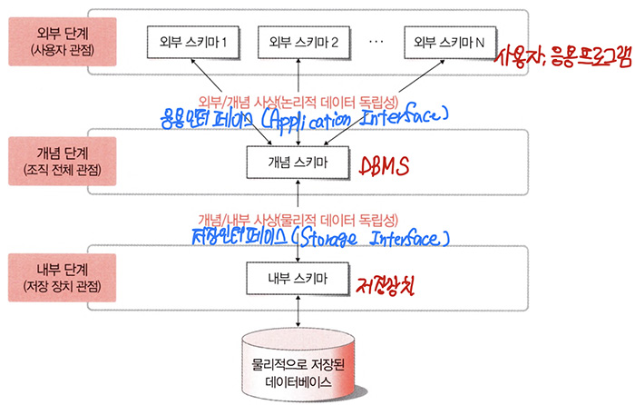

# <a href = "../README.md" target="_blank">데이터베이스 개론</a>
## Chapter 03. 데이터베이스 시스템의 정의
### 3.2 데이터베이스의 구조
1) 스키마
2) 3단계 데이터베이스 구조
3) 데이터 독립성
4) 데이터 사전

---

# 3.2 데이터베이스의 구조

## 1) 스키마
1. 스키마 : 데이터베이스에 저장되는 데이터 구조와 제약조건을 정의한 것.
   - 3층 구조 : 외부 스키마, 개념 스키마, 내부 스키마
   - 데이터베이스의 틀, 골격에 해당하는 부분이므로 보통은 자주 변경되지 않는다.
   

2. 인스턴스 : 데이터베이스에 실제로 저장된 값
   - 계속 변하는 특성이 있음.

---

## 2) 3단계 데이터베이스 구조

1. 3단계 데이터 구조(3-level database architecture)
   - 미국의 표준화 기관 ANSI/SPARC 에서 제안한 데이터베이스의 3단계 구조
       - 외부 스키마, 개념 스키마, 내부 스키마
   - 데이터의 저장, 유지 등 복잡한 내부 내용을 숨기고, 필요한 데이터만 단순화한 외부 단계 관점을 일반 사용자들에게 제공할 수 있다.
   - 각 단계별로 추상화 레벨을 다르게 부여(외부에 가까이 갈 수록, 더 추상화 레벨이 높아짐) 

2. 외부 스키마 : 개별 사용자 관점에서 바라보는 외부 단계
   - 개별 사용자 관점으로 데이터베이스를 이해하고 표현
   - 외부 단계의 사용자에게 필요한 데이터베이스를 정의한 것.
   - 데이터베이스 하나에는 여러개의 외부 스키마가 존재할 수 있고, 외부 스키마 하나를 같은 사용자들이 공유할 수 있음.
   - 전체 데이터 베이스 중, 사용자가 관심을 가지는 일부분이라는 관점에서 서브 스키마(Sub Schema)라고도 함.

3. 개념 스키마 : 조직 전체의 관점에서 바라보는 개념 단계
   - 데이터베이스를 이용하는 사용자들의 관점을 통합하여, 데이터베이스를 조직 전체의 관점에서 이해하고 표현
   - DBMS, 데이터베이스 관리자의 관점에서 모든 사용자에게 필요한 데이터를 통합하여, 전체 데이터베이스의 논리적 구조를 정의
   - 모든 개별 사용자가 생각하는 데이터베이스의 모습을 하나로 합친 형태
   - 전체 데이터베이스에 어떤 데이터가 저장되는지, 데이터들 간에 어떤 관계가 존재하고 어떤 제약조건이 있는지, 데이터에 대한 보한 정책이나 접근 권한은 어떻게 부여되어있는 지
   - 보통 '스키마'라고 하면, 개념스키마를 지칭함

4. 내부 스키마 : 물리적 저장장치 관점에서 바라보는 내부 단계
   - 데이터베이스가 저장 장치에 실제로 저장되는 방법을 정의
   - 데이터베이스 파일에 데이터를 저장하는 레코드의 구조, 레코드를 구성하는 필드의 크기, 인덱스를 이용한 레코드 접근 경로 등을 정의
   - 어떤 데이터베이스의 개념 스키마에 대한 물리적인 저장구조를 표현하므로, 하나의 데이터베이스에 하나만 존재

---

## 3) 데이터 독립성

- 외부 스키마를 통해 원하는 데이터를 얻으려면 내부 스키마에 따라 저장된 데이터베이스에 접근해야 함.
- 각 스키마 사이의 유기적인 연관관계가 성립하도록 해야, 데이터 독립성을 실현할 수 있음

1. 사상(매핑, mapping)
   - 스키마 사이의 대응관계
   - DBMS는 미리 정의된 외부/개념 사상과, 개념/내부 사상 정보를 이용해, 사용자가 원하는 데이터에 접근할 수 있다.

2. 데이터 독립성
   - 하위 스키마를 변경하더라도 상위 스키마가 영향을 받지 않는 특성
   - DBMS에서 3단계 데이터베이스 구조를 나누고, 단계별로 스키마를 유지하며 사상 정보(대응 관계)를 정의함으로서, 데이터 독립성을 실현
   - 3단계 데이터베이스 구조에는 논리적 데이터 독립성과 물리적 데이터 독립성이 존재
   

3. 논리적 데이터 독립성
   - 개념 스키마가 변경되더라도 외부 스키마가 영향을 받지 않는 것
   - 외부 스키마의 사용자가, 전체 데이터베이스의 논리적 구조가 변경되었다는 사실을 알 필요가 없음
   - 외부/개념 사상 : 응용 인터페이스(application interface)
   - 데이터베이스의 개념 스키마가 변경되더라도, 외부/개념 사상을 수정하면 됨.
   - 개념 스키마에 새로운 내용이 추가, 새로운 내용이 삭제되더라도 외부 스키마는 영향을 받지 아니함

4. 물리적 데이터 독립성
   - 내부 스키마가 변경되더라도 개념 스키마가 영향을 받지 않는 것. 결과론적으로, 외부 스키마도 영향을 받지 않음
   - 개념/내부 사상 : 저장 인터페이스(storage interface)
   - 데이터베이스의 내부 스키마가 변경되더라도, 개념/내부 사상을 수정하면 됨. 데이터베이스의 논리적 구조(개념 스키마)는 영향받지 않음.
     - 예) 주소 다음에 연락처 필드가 저장되어 있는데 이 순서를 뒤바꾸더라도(내부 스키마의 변경) 두 필드와 관련된 개념/내부 사상정보(mapping)만 수정해주면 됨. 개념 스키마, 외부 스키마는 영향을 받지 않음.

5. 결론
   - 하위 스키마가 변경되더라도 연결관계(사상, 그림에서의 선)를 다시 맵핑해주면 된다...!
   - 하위 스키마를 변경하더라도 상위 스키마를 변경하지 않아도 된다.
   - DBMS가 이 사상정보 변경 등의 관리를 지원해줌으로서, 데이터 독립성을 편리하게 실현할 수 있다.

---

## 4) 데이터 사전

1. 데이터 사전(Data Dictionary)
   - 데이터 저장에 필요한 부가정보(스키마, 스키마 간의 사상 정보)를 저장하는 곳
   - 시스템 카탈로그(System Catalog), 혹은 시스템 데이터베이스(System DataBase)라고도 한다.
     - (cf) 사용자 데이터베이스(User DataBase) : 사용자가 실제로 이용하는 데이터가 저장되는 일반 데이터베이스
   - 메타 데이터(DataBase MetaData) : 데이터 사전에 저장되는 데이터. 데이터베이스에 저장되는 데이터에 대한 데이터.

2. 데이터 사전의 특징
   - DBMS가 스스로 생성하고 유지
   - DBMS가 주로 접근하지만, 일반 사용자도 데이터 언어를 통해 접근할 수 있음.
   - 사용자는 저장 내용을 검색만 할 수 있을 뿐, 추가/수정/삭제를 통해 갱신할 없다.

3. 데이터 카탈로그(Data Catalog)
   - 데이터 사전에 있는 데이터에 **실제로 접근**하는데 필요한 위치 정보를 관리하는 데이터 베이스.
   - 시스템만 접근 가능할 수 있고, 사용자는 접근할 수 없음

---