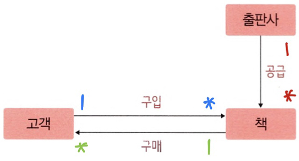

# <a href = "../README.md" target="_blank">데이터베이스 개론</a>
## Chapter 04. 데이터 모델링
### 4.3 논리적 데이터 모델
1) 논리적 데이터 모델의 개념과 특성
2) 계층 데이터 모델
3) 네트워크 데이터 모델

---

# 4.3 논리적 데이터 모델

- 개념적인 구조를 데이터베이스에 표현하는 형태를 결정
- 관건은 DBMS의 종류!

---

## 1) 논리적 데이터 모델의 개념과 특성
1. 논리적 데이터 모델 : 데이터베이스에 저장할 논리적인 구조
   - 논리적 데이터 모델링의 결과물
   - 사용자가 생각하는 데이터베이스의 모습 또는 구조
   - 데이터베이스 스키마 : 논리적 데이터 모델로 표현된 데이터베이스의 논리적 구조

2. 종류
   - 관계형 데이터 모델 : 2차원 테이블 형태
   - 계층형 데이터 모델 : 트리 형태
   - 네트워크 데이터 모델 : 그래프 또는 네트워크 형태
   - 객체지향 데이터 모델 : 논리적 데이터 모델로 객체의 개념을 도입
   - 객체관계 데이터 모델 : 객체지향 데이터 모델 + 관계 데이터 모델

3. 선택
   - 일반적으로 데이터베이스 관리 시스템은 논리적 데이터 모델을 하나만 지원함.
   - 데이터베이스를 구축하는 환경에 맞는 데이터베이스 관리 시스템을 먼저 선택 후, 이를 지원하는 논리적 데이터 모델을 선택해야함.
   
---

## 2) 계층 데이터 모델

1. 계층형 데이터 모델(Hierarchical_Data_Model)
   - 개체를 사각형으로 나타내고, 개체들 간의 관계는 링크(연결선)으로 나타내는 계층형 트리(Tree) 구조.
   - 링크를 일대일, 일대다 관계로만 표현할 수 있음.
     - 다대다 관계 : 일대다-일대다의 방식으로 추가로 개체를 정의하여 표현
   - 두 개체 사이의 관계를 하나만 정의할 수 있기 때문에, 관계에 이름을 붙여 구별할 필요가 없음.

2. 부모, 자식 관계
   - 트리 구조기 때문에, 최상위 root 개체가 존재하고, 사이클(순환구조)이 존재하지 않음.
   - 일대일, 일대다 관계를 맺는 개체 간에는 상하관계가 성립함.
   - 상위에 있는 개체를 부모개체, 하위에 있는 개체를 자식 개체로 하여, 이들 사이의 일대다 관계를 부모-자식관계라고 함.
   - 모든 개체는, 부모개체를 하나만 가질 수 있는 제약사항이 존재함.

3. 계층 데이터 모델의 문제점
   - 개체 사이의 관계를 정의할 때, 제약사항이 많아서, 개념적 구조를 논리적 구조로 자연스럽게 모델링 할 수 없음. 구조가 복잡해질 수 있음.
   - 원하는 데이터의 CRUD가 쉽지 않음

---

## 3) 네트워크 데이터 모델

1. 네트워크 데이터 모델(Network Date Model)
   - 데이터베이스의 논리적 구조가 그래프 또는 네트워크 형태
   - 개체는 사각형으로 관계는 화살표로 나타냄.
     - 화살표는 일대일, 일대다 관계만 표현할 수 있음.
   - 관계를 여러개 정의할 수 있고, 각 관계들을 이름으로 구별함.
   - 같은 개체 간들간의 관계를 두 개 이상 표현할 수 있어서, 계층 데이터 모델보다 개념적 구조를 논리적으로 더 자연스럽게 모델링할 수 있음.

2. 오너, 멤버 관계
   - 일대다 관계의 개체를 오너-멤버로 칭함
   - 하나의 오너개체가 멤버개체 여러개와 관계를 맺을 수 있음.
   - 하나의 멤버개체가 여러개의 오너 개체와 관계를 맺을 수 있음.

3. 네트워크 데이터 모델의 한계
   - 계층 데이터 모델보다 구조가 더 복잡해질 수 있어서, 데이터의 CRUD가 계층 데이터 모델보다 더 어려워짐.

---