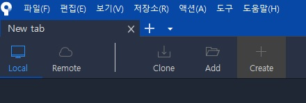
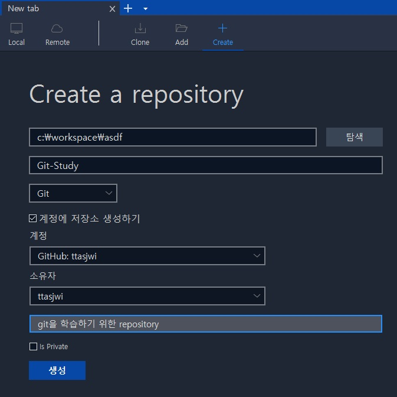
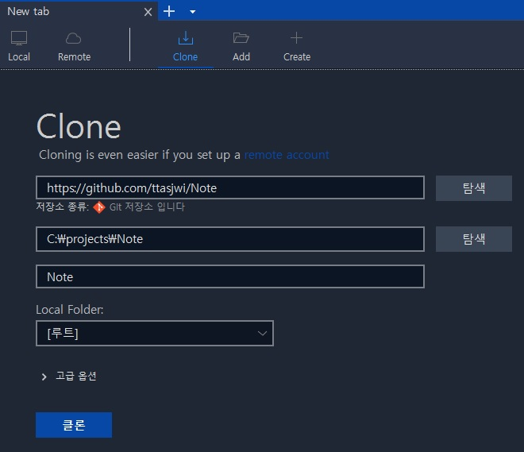
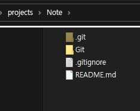

---

# <a href = "../README.md" target="_blank">Git</a>
## <a href = "README.md" target="_blank">Chpater 2. Git의 기초</a>
### 2.1 Git 저장소 만들기
1) 기존 디렉토리를 Git 저장소로 만들기 (git init)
2) SourceTree에서 기존 디렉토리를 Git 저장소로 만들기
3) 기존 저장소를 Clone 하기 (git clone)
4) SourceTree에서 기존 저장소를 Clone 하기

---

## 1) 기존 디렉토리를 Git 저장소로 만들기 (git init)
터미널에서 cd 명령을 통해 프로젝트의 디렉토리로 이동하여
> git init

을 입력한다.


- 결과 : 하위에 `.git` 디렉토리 생성. 해당 디렉토리를 git으로 관리하게 됨.
  - `.git` : git 저장소에 필요한 핵심 파일들이 들어있음.
- `init` 명령만으로는 어떤 파일도 관리하지 않음. `add` 및 `commit` 명령을 통해 원하는 파일을 `git`으로 관리할 수 있음.

---

## 2) SourceTree에서 기존 디렉토리를 Git 저장소로 만들기




- `create`에서 디렉토리 생성과 동시에 `init`을 하거나, 이미 존재하는 디렉토리에 `init`을 할 수 있음.
- `init`과 동시에, 원격 저장소로 관리하도록 할 수 있음.

---

## 3) 기존 저장소를 Clone 하기 (git clone)
원하는 git 프로젝트 저장소 폴더를 현재 디렉토리의 하위에 복사하는 명령 
> git clone url  
> git clone url 지정폴더명

### 예시1>
```
git clone https://github.com/ttasjwi/Algorithm
```
- 현재 폴더 하위에 `Algorithm`폴더를 만들고 그 안에 `.git` 디렉토리 생성
- 저장소의 데이터를 모두 가져와서, 자동으로 가장 최신 버전을 `checkout`함 (파일을 꺼내옴)

### 예시2>
```
git clone https://github.com/ttasjwi/Algorithm asdf
```
- 위와 구조적으로 하는 일은 같은데, 폴더 이름을 asdf로 하여 생성함. 

---

## 4) SourceTree에서 기존 저장소를 Clone 하기



- `clone`에서 로컬 git 저장소 또는 원격 저장소로부터 git을 클론해올 수 있음
- 가져와짐과 동시에, 가장 최신 버전을 checkout함 (파일을 꺼내옴)

---

## 5) 그 외

git은 다양한 프로토콜을 지원해서, `https://` 프로토콜 외에도 `git://` 프로토콜을 사용하거나, `user@server:path/to/repo.git`과 같은 SSH 프로토콜을 사용할 수 있다.

---
