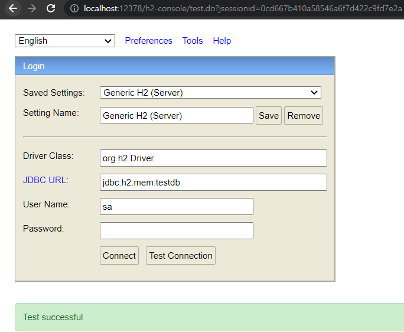

# <a href = "../README.md" target="_blank">Spring Cloud로 개발하는 마이크로서비스 애플리케이션(MSA)</a>
## Chapter 04. E-commerce 애플리케이션
### 5.1 Users Microservice - 프로젝트 생성
1) Spring Boot 프로젝트 생성
2) build.gradle
3) application.yml
4) 테스트용 엔드포인트 설정
5) 실행 확인

---

# 5.1 Users Microservice - 프로젝트 생성

---

## 1) Spring Boot 프로젝트 생성
- Spring Boot Web : MVC
- Spring Data Jpa : JPA
- Spring Validation : 검증
- Spring Boot Devtools
- H2 Database : H2 데이터베이스 드라이버
- Lombok : 롬복
- Spring Cloud Netflix Eureka Client : 넷플릭스 유레카 클라이언트

---

## 2) build.gradle
```groovy
dependencies {
  implementation 'org.springframework.boot:spring-boot-starter-web'
  implementation 'org.springframework.boot:spring-boot-starter-data-jpa'
  implementation 'org.springframework.boot:spring-boot-starter-validation'
  implementation 'org.springframework.cloud:spring-cloud-starter-netflix-eureka-client'

  runtimeOnly 'com.h2database:h2'

  compileOnly 'org.projectlombok:lombok'
  annotationProcessor 'org.projectlombok:lombok'

  implementation 'com.github.gavlyukovskiy:p6spy-spring-boot-starter:1.8.1'
  developmentOnly 'org.springframework.boot:spring-boot-devtools'
  testImplementation 'org.springframework.boot:spring-boot-starter-test'

  // 테스트에서 lombok 사용
  testCompileOnly 'org.projectlombok:lombok'
  testAnnotationProcessor 'org.projectlombok:lombok'
}
```
- p6spy : 파라미터를 로그에 남기고 추가적인 기능 제공
- 테스트에서 롬복을 사용할 수 있도록 추가적인 dependencies를 추가했다.


## 3) application.yml
```yaml
server:
  port: 0 # 0으로 지정하면 랜덤 포트로 실행됨

spring:
  application:
    name: user-service # 마이크로서비스 이름

  datasource:
    url: jdbc:h2:mem:testdb
    username: sa
    password:
    driver-class-name: org.h2.Driver

  h2:
    console:
      enabled: true

  jpa:
    properties:
      hibernate:
        # show_sql: true # sout으로 하이버네이트 실행 SQL을 남기는데 이는 아래의 spring.logging.level.org.hibernate.SQL 옵션에서 log로 대체
        format_sql: true # sql을 로깅할 때 예쁘게 보여줌

logging:
  level:
    org.hibernate.SQL: debug # 하이버네이트 실행 SQL을 logger를 통해 남긴다.
#    org.hibernate.type: trace # 쿼리 parameter의 값을 로그로 남김. 대체재로 p6spy가 있다. 배포환경에서는 사용하지 성능 상 문제가 있다면 사용할지 말지를 고민하는 것이 좋다.

eureka:
  instance:
    instance-id: ${spring.application.name}:${spring.application.instance_id:${random.value}}
  client:
    register-with-eureka: true # 유레카 서버에 등록할 것인가? -> true
    fetch-registry: true # 유레카 서버로부터 인스턴스들의 정보를 주기적으로 가져올 것인가 -> true
    eureka-service-url:
      defaultZone: http://127.0.0.1:8761/eureka # 유레카 서비스의 위치, 엔드포인트

greeting:
  message: Welcome to the simple E-commerce.
```
- `server.port: 0` : 실행할 때마다 매 번 랜덤 포트에서 실행하도록 한다. (기존에 존재하는 포트와 겹치지 않는다.)
- `spring.datasource` : datasource 설정
  - `url=jdbc:h2:mem:testdb` : 인메모리 DB
- `spring.h2.console.enable=true` : H2 데이터베이스 웹 콘솔 접근 활성화
- 유레카 설정
  - `eureka.instance.instance-id` : 인스턴스 각각에게 고유한 식별자를 부여하기 위함. 기본 설정을 사용할 경우,
    `server.port:0`이 문제가 되어 중복 인트턴스로 간주되는 문제가 있다.
  - 유레카 서버에 등록하기 위해, register-with-eureka 옵션을 활성화한다.
  - 다른 인스턴스들의 정보를 주기적으로 가져오기 위해 fetch-registry 옵션을 활성화한다.
- 로깅 설정
  - `logging.level.org.hibernate.SQL=debug` : 하이버네이트 실행 SQL을 logger를 통해 남긴다.
  - `spring.jpa.properties.hibernate.format_sql=true` : sql을 로깅할 때 예쁘게 보여줌
- `greeting.message` : 간단한 인사메시지

---

## 4) 테스트용 엔드포인트 설정

### 4.1 Greeting
```java
@Component
@Getter
public class Greeting {

    @Value("${greeting.message}")
    private String message;
}

```
- 설정 파일의 `greeting.message`을 읽어올 때, `@Value`를 사용
  - 값으로, `${}`을 사용하여 내부적으로 설정 이름을 지정하면 됨
- 컴포넌트로 등록했다.

### 4.2 UserController
```java

@RequiredArgsConstructor
@RestController
@RequestMapping("/")
public class UserController {

//    private final Environment env;
    private final Greeting greeting;

    @GetMapping("/health-check")
    public String status() {
        return "It's working in USER-SERVICE";
    }

    @GetMapping("/welcome")
    public String welcome() {
         //return env.getProperty("greeting.message");
        return greeting.getMessage();
    }
}
```
- `/health-check` : 메시지 확인
- `/welcome` : greeting.message 출력

---

## 5) 실행 확인

### 5.1 유레카 서버 기동
- 서비스 디스커버리 프로젝트로 이동하여 `./gradlew bootRun` 실행
- 8761번 포트에서 기동됨

### 5.2 USER-SERVICE 기동
- IntelliJ 에서 기동, 랜덤포트에 바인딩됨.

### 5.3 Eureka를 통해 USER-SERVICE 접근 후 확인
```shell
# /health-check
It's working in USER-SERVICE

# /welcome
Welcome to the simple E-commerce.
```
- 정상적으로 적용된 것을 확인할 수 있다.

### 5.4 인메모리 DB 접근 확인


- `/h2-console`을 통해 웹 콘솔에 접근한다.
- `jdbc:h2:mem:testdb`로 Test-Conncection을 시도해, 제대로 동작하는 지 확인한다.

---
