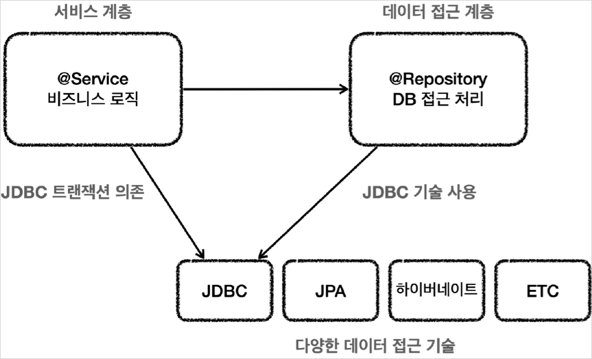
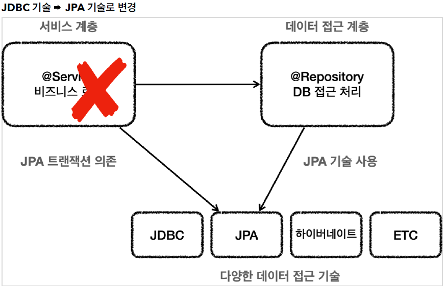
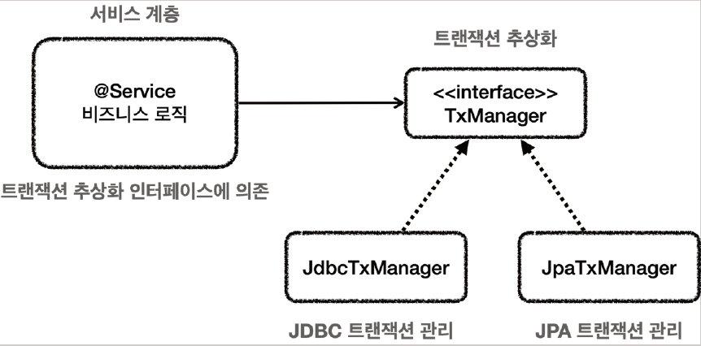

# <a href = "../README.md" target="_blank">스프링 DB 1편 - 데이터 접근 핵심 원리</a>
## Chapter 04. 스프링과 문제 해결 - 트랜잭션
### 4.02 트랜잭션 추상화
1) 데이터 접근 기술 변경 시 트랜잭션 코드도 변경해야한다.
2) 트랜잭션을 추상화
3) 스프링의 트랜잭션 추상화 - PlatformTransactionManager

---

# 4.02 트랜잭션 추상화

---

## 1) 데이터 접근 기술 변경 시 트랜잭션 코드도 변경해야한다.

### 1.1 데이터 접근 기술별로 트랜잭션 사용법이 다르다.
```java

// jdbc
public void accountTransfer(String fromId, String toId, int money) throws SQLException {
    Connection con = dataSource.getConnection();
    try {
        con.setAutoCommit(false); //트랜잭션 시작
        
        // 비즈니스 로직
        bizLogic(con, fromId, toId, money);
        
        con.commit(); //성공시 커밋
    } catch (Exception e) {
        con.rollback(); //실패시 롤백
        throw new IllegalStateException(e);
    } finally {
        release(con);
    }
}
```
```java
// jpa
public static void main(String[] args) {
    //엔티티 매니저 팩토리 생성
    EntityManagerFactory emf = Persistence.createEntityManagerFactory("jpabook");
    EntityManager em = emf.createEntityManager(); //엔티티 매니저 생성
    EntityTransaction tx = em.getTransaction(); //트랜잭션 기능 획득
    
    try {
        tx.begin(); //트랜잭션 시작
        logic(em); //비즈니스 로직
        tx.commit();//트랜잭션 커밋
    } catch (Exception e) {
        tx.rollback(); //트랜잭션 롤백
    } finally {
        em.close(); //엔티티 매니저 종료
    }
    emf.close(); //엔티티 매니저 팩토리 종료
}
```
- 트랜잭션은 원자적 단위의 비즈니스 로직을 처리하기 위해 사용한다.
- 구현 기술마다 트랜잭션을 사용하는 방법이 다르다.
    - JDBC : `con.setAutoCommit(false)`
    - JPA : `transaction.begin()`

### 1.2 데이터 접근기술 변경 시 서비스 단에서 트랜잭션 코드를 변경해야함.



- 현재 서비스 계층은 트랜잭션을 사용하기 위해서 JDBC 기술에 의존하고 있다.
- 향후 JDBC에서 JPA 같은 다른 데이터 접근 기술로 변경하면, 서비스 계층의 트랜잭션 관련 코드도 모두 함께 수정해야 한다.

---

## 2) 트랜잭션을 추상화

### 2.1 트랜잭션 역할을 추상화
```java
public interface TxManager {
    begin();
    commit();
    rollback();
}
```
트랜잭션은 사실 단순하다. 트랜잭션을 시작하고, 비즈니스 로직의 수행이 끝나면 커밋하거나 롤백하면 된다.  
다음과 같이 TxManager 인터페이스를 기반으로 각각의 기술에 맞는 구현체를 만들면 된다.
- `JdbcTxManager` : JDBC 트랜잭션 기능을 제공하는 구현체
- `JpaTxManager` : JPA 트랜잭션 기능을 제공하는 구현체

### 2.2 트랜잭션 추상화와 의존관계

- 서비스는 특정 트랜잭션 기술에 직접 의존하는 것이 아니라, `TxManager` 라는 추상화된 인터페이스에 의존한다.
- 이제 원하는 구현체를 DI를 통해서 주입하면 된다.
  - JDBC 트랜잭션 기능이 필요하면 JdbcTxManager 를 주입
  - JPA 트랜잭션 기능으로 변경해야 하면 JpaTxManager 를 주입
- 클라이언트인 서비스는 인터페이스에 의존하고 DI를 사용한 덕분에 OCP 원칙을 지키게 되었다.
- 이제 트랜잭션을 사용하는 서비스 코드를 전혀 변경하지 않고, 트랜잭션 기술을 마음껏 변경할 수 있다.

---

## 3) 스프링의 트랜잭션 추상화 - PlatformTransactionManager


### 3.1 스프링은 이미 트랜잭션을 추상화함
- 스프링은 이미 트랜잭션을 `PlatformTransactionManager` 인터페이스로 추상화했다.
  - `org.springframework.transaction.PlatformTransactionManager`
- 우리는 스프링이 제공하는 트랜잭션 추상화 기술을 사용하면 된다.
- 심지어 데이터 접근 기술에 따른 트랜잭션 구현체도 대부분 만들어두어서 가져다 사용하기만 하면 된다.
  - (cf) 스프링 5.3부터는 JDBC 트랜잭션을 관리할 때 DataSourceTransactionManager 를 상속받아서 약간의 기능을 확장한 JdbcTransactionManager 를 제공한다. 둘의 기능 차이는 크지 않으므로 같은 것으로 이해하면 된다.

### 3.2 PlatformTransactionManager 인터페이스
```java
package org.springframework.transaction;

public interface PlatformTransactionManager extends TransactionManager {
    
    TransactionStatus getTransaction(@Nullable TransactionDefinition definition) throws TransactionException;
    void commit(TransactionStatus status) throws TransactionException;
    void rollback(TransactionStatus status) throws TransactionException;
}
```
- `getTransaction()` : 트랜잭션을 시작한다.
  - 이름이 `getTransaction()` 인 이유는 기존에 이미 진행중인 트랜잭션이 있는 경우 해당 트랜잭션에 참여할 수 있기 때문이다.
  - 트랜잭션 참여, 전파에 대한 부분은 뒤에서 학습
- `commit()` : 트랜잭션을 커밋한다.
- `rollback()` : 트랜잭션을 롤백한다.

---