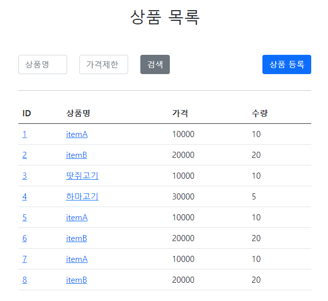

# <a href = "../README.md" target="_blank">스프링 DB 2편 - 데이터 접근 활용 기술</a>
## Chapter 02. 데이터 접근 기술 - 스프링 JdbcTemplate
### 2.4 JdbcTemplate 적용3 - 구성과 실행
1) 리포지토리 설정 변경 - JdbcTemplateV1Config
2) 데이터베이스 접근 설정 : datasource 설정
3) 실행 확인
4) JdbcTemplate SQL 로그 확인 - 로깅 설정

---

# 2.4 JdbcTemplate 적용3 - 구성과 실행

---

## 1) 리포지토리 설정 변경 - JdbcTemplateV1Config

### 1.1 설정 생성
```java
package hello.itemservice.config;

// import 생략

@Configuration
@RequiredArgsConstructor
public class JdbcTemplateV1Config {

    private final DataSource dataSource;

    @Bean
    public ItemService itemService() {
        return new ItemServiceV1(itemRepository());
    }

    @Bean
    public ItemRepository itemRepository() {
        return new JdbcTemplateItemRepositoryV1(dataSource);
    }

}
```
- `ItemRepository` 구현체로 `JdbcTemplateItemRepositoryV1` 이 사용되도록 했다.
- 이제 메모리 저장소가 아니라 실제 DB에 연결하는 JdbcTemplate이 사용된다.

### 1.2 설정 정보 변경
```java
//@Import(MemoryConfig.class)
@Import(JdbcTemplateV1Config.class)
@SpringBootApplication(scanBasePackages = "hello.itemservice.web")
public class ItemServiceApplication {
```
- `MemoryConfig` 설정파일을 참조하던 것을, `JdbcTemplateV1Config`을 참조하도록 변경했다.

---

## 2) 데이터베이스 접근 설정 : datasource 설정
`src/main/resources/application.properties`
```properties
# DataSource 설정
spring.datasource.url=jdbc:h2:tcp://localhost/~/itemservice-db
spring.datasource.username=sa
spring.datasource.password=
```
- 이렇게 설정만 하면 스프링 부트가 해당 설정을 사용해서 다음을 스프링 빈으로 등록한다.
  - 커넥션 풀 DataSource
  - 트랜잭션 매니저
- datasource, 트랜잭션 매니저는 스프링DB 1편을 참고
- (주의) 여기서는 `src/test` 가 아니라 `src/main` 에 위치한 `application.properties` 파일을 수정해야 한다!

---

## 3) 실행 확인

- 실제 DB에 연결해야 하므로 H2 데이터베이스 서버를 먼저 실행한다.
- 앞서 만든 item 테이블이 잘 생성되어 있는지 다시 확인한다.
- `ItemServiceApplication.main()` 을 실행해서 애플리케이션 서버를 실행한다.
- 웹 브라우저로 http://localhost:8080 에 접속한다. 
- 실행해보면 잘 동작하는 것을 확인할 수 있다. 그리고 DB에 실제 데이터가 저장되는 것도 확인할 수 있다.
  - 서버를 다시 시작할 때 마다 `TestDataInit` 이 실행되기 때문에 itemA , itemB 도 데이터베이스에 계속 추가된다.
  - 메모리와 다르게 서버가 내려가도 데이터베이스는 유지되기 때문이다.

---

## 4) JdbcTemplate SQL 로그 확인 - 로깅 설정
```properties
#jdbcTemplate sql log
logging.level.org.springframework.jdbc=debug
```

- `JdbcTemplate`이 실행하는 SQL 로그를 확인하려면 `application.properties` 에 위의 설정 정보를을 추가하면 된다.
- `main` , `test` 설정이 분리되어 있기 때문에 둘다 확인하려면 두 곳에 모두 추가해야 한다.
