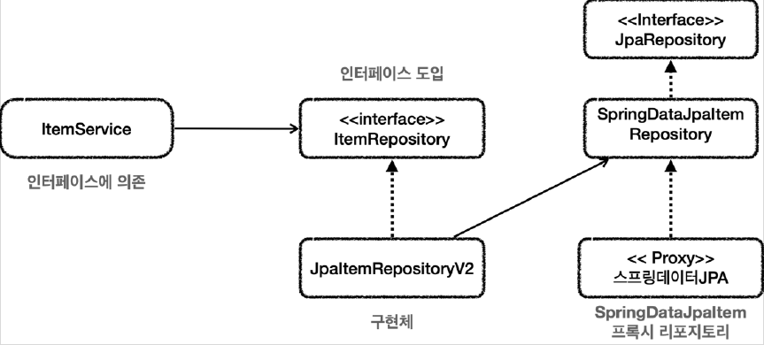

# <a href = "../README.md" target="_blank">스프링 DB 2편 - 데이터 접근 활용 기술</a>
## Chapter 06. 데이터 접근 기술 - 스프링 데이터 JPA
### 6.5 스프링 데이터 JPA 적용2
1) JpaItemRepositoryV2 - Spring Data JPA 적용
2) 리포지토리 분석
3) 스프링 데이터 JPA의 예외 변환
4) 리포지토리 설정 변경 - SpringDataJpaConfig
5) 테스트 및 애플리케이션 실행
6) (추가) 하이버네이트 버그(스프링 부트 2.6.5, 하이버네이트 5.6.7)

---

# 6.5 스프링 데이터 JPA 적용2

---

## 1) JpaItemRepositoryV2 - Spring Data JPA 적용

### 1.1 서비스 계층의 ItemRepository를 의존성을 깨고 싶지 않다.
- `ItemService` 는 `ItemRepository` 에 의존하기 때문에 ItemService 에서 `SpringDataJpaItemRepository` 를 그대로 사용할 수 없다.
- 물론 `ItemService` 가 `SpringDataJpaItemRepository` 를 직접 사용하도록 코드를 고치면 되긴한다.
  - 하지만, 이를 고치면 Service를 뜯어고쳐야한다.
- 우리는 `ItemService` 코드의 변경없이 `ItemService` 가 `ItemRepository` 에 대한 의존을 유지하면서 DI를 통해 구현 기술을 변경하고 싶다.

### 1.2 클래스 의존관계 : 어댑터 구현체 도입(JpaItemRepositoryV2)

```java
@Repository
@Transactional
@RequiredArgsConstructor
public class JpaItemRepositoryV2 implements ItemRepository {
    
    private final SpringDataJpaItemRepository repository;
    
}
```
- `ItemService`는 `ItemRepository` 인터페이스를 여전히 의존한다.
- `SpringDataJpaItemRepository`로 바로 인터페이스 의존관계를 변경할 수 없으므로 어댑터로 `JpaItemRepositoryV2`를 만든다.
  - `JpaItemRepositoryV2`를 추후 스프링 빈으로 등록하여 ItemService는 런타임에 `JpaItemRepositoryV2` 객체 인스턴스를 주입받을 것이다. 
- `JpaItemRepositoryV2`는 `SpringDataJpaItemRepository` 인터페이스를 의존한다.
  - `Spring-Data-Jpa`의 공통 인터페이스 기능 의해 실제 런타임에는 프록시 기술을 적용한 리포지토리 구현체가 주입될 것이다.
- `JpaItemRepositortV2`는 `SpringDataJpaItemRepository`의 역할에 의존하여, 해당 기능을 가져다 사용하기만 하면 된다.

### 1.3 런타임 의존관계


런타임의 객체 의존관계는 다음과 같이 동작한다.
- `itemService` → `jpaItemRepositoryV2` → `springDataJpaItemRepository`(프록시 객체)
- 이렇게 중간에서 `JpaItemRepository` 가 어댑터 역할을 해준 덕분에 `ItemService` 가 사용하는 `ItemRepository` 인터페이스를 그대로 유지할 수 있고, 클라이언트인 `ItemService` 의 코드를 변경하지 않아도 되는 장점이 있다.

---

## 2) 리포지토리 분석

### 2.1 등록 - `save()`
```java
    @Override
    public Item save(Item item) {
        return repository.save(item);
    }
```
스프링 데이터 JPA가 제공하는 save() 를 호출한다.

### 2.2 수정 - `update()`
```java
    @Override
    public void update(Long itemId, ItemUpdateDto updateParam) {
        Item findItem = repository.findById(itemId).get();
        findItem.setItemName(updateParam.getItemName());
        findItem.setPrice(updateParam.getPrice());
        findItem.setQuantity(updateParam.getQuantity());
    }
```
- 스프링 데이터 JPA가 제공하는 `findById()` 메서드를 사용해서 엔티티를 찾는다.
- 그리고 데이터를 수정한다. 이후 트랜잭션이 커밋될 때 변경 내용이 데이터베이스에 반영된다. (JPA가 제공하는 기능이다.)

### 2.3 단건(식별자) 조회 - `findById()`
```java
    @Override
    public Optional<Item> findById(Long id) {
        return repository.findById(id);
    }
```
스프링 데이터 JPA가 제공하는 `findById()` 메서드를 사용해서 엔티티를 찾는다.

### 2.4 상품 검색- `findAll()`
```java
    @Override
    public List<Item> findAll(ItemSearchCond cond) {
        String itemName = cond.getItemName();
        Integer maxPrice = cond.getMaxPrice();

        if (StringUtils.hasText(itemName) && maxPrice != null) {
            // return repository.findByItemNameLikeAndPriceLessThanEqual("%" + itemName + "%", maxPrice);
            return repository.findItems("%" + itemName + "%", maxPrice);
        } else if (StringUtils.hasText(itemName) && maxPrice == null) {
            return repository.findByItemNameLike("%" + itemName + "%");
        } else if (maxPrice != null) {
            return repository.findByPriceLessThanEqual(maxPrice);
        } else {
            return repository.findAll();
        }
    }
```
- 데이터를 조건에 따라 4가지로 분류해서 검색한다.
  - 모든 데이터 조회
  - 이름 조회
  - 가격 조회
  - 이름 + 가격 조회
- 모든 조건에 부합할 때는 `findByItemNameLikeAndPriceLessThanEqual()` 를 사용해도 되고, `repository.findItems()` 를 사용해도 된다.
  - 그런데 보는 것 처럼 조건이 2개만 되어도 이름이 너무 길어지는 단점이 있다.
  - 따라서 스프링 데이터 JPA가 제공하는 메서드 이름으로 쿼리를 자동으로 만들어주는 기능과 `@Query` 로 직접 쿼리를 작성하는 기능 중에 적절한 선택이 필요하다.
- 구현 코드를 확인해보면, 동적 쿼리가 아니라 상황에 따라 각각 스프링 데이터 JPA의 메서드를 호출해서 상당히 비효율 적인 코드인 것을 알 수 있다.
  - 스프링 데이터 JPA는 동적 쿼리 기능에 대한 지원이 매우 약하다.
  - 이 부분은 이후에 Querydsl을 사용해서 개선해볼 것이다.

---

## 3) 스프링 데이터 JPA의 예외 변환
- 스프링 데이터 JPA도 스프링 예외 추상화를 지원한다.
- 스프링 데이터 JPA가 만들어주는 프록시에서 이미 예외 변환을 처리하기 때문에, `@Repository`와 관계없이 예외가 변환된다.

---

## 4) 리포지토리 설정 변경 - SpringDataJpaConfig

### 4.1 설정 생성
```java
@Configuration
@RequiredArgsConstructor
public class SpringDataJpaConfig {

    private final SpringDataJpaItemRepository springDataJpaItemRepository;

    @Bean
    public ItemService itemService() {
        return new ItemServiceV1(itemRepository());
    }

    @Bean
    public ItemRepository itemRepository() {
        return new JpaItemRepositoryV2(springDataJpaItemRepository);
    }

}
```
- `SpringDataJpaItemRepository` 는 스프링 데이터 JPA가 프록시 기술로 만들어주고 스프링 빈으로도 등록해준다.

### 4.2 설정 정보 변경
```java
@Slf4j
//@Import(MemoryConfig.class)
//@Import(JdbcTemplateV1Config.class)
//@Import(JdbcTemplateV2Config.class)
//@Import(JdbcTemplateV3Config.class)
//@Import(MyBatisConfig.class)
//@Import(JpaConfig.class)
@Import(SpringDataJpaConfig.class)
@SpringBootApplication(scanBasePackages = "hello.itemservice.web")
public class ItemServiceApplication {
```
`SpringDataJpaConfig` 를 사용하도록 변경했다.

---

## 5) 테스트 및 애플리케이션 실행
- 테스트 실행 : `ItemRepositoryTest`의 테스트를 반복 시행한다.
- 애플리케이션 실행 : http://localhost:8080 접속 후 기능이 잘 동작하는지 확인

---

## 6) (추가) 하이버네이트 버그(스프링 부트 2.6.5, 하이버네이트 5.6.7)

### 6.1 이슈
```shell
  java.lang.IllegalArgumentException: Parameter value [\] did not match expected type
  [java.lang.String (n/a)]
```
하이버네이트 5.6.6 ~ 5.6.7 을 사용하면 Like 문장을 사용할 때 위 예외가 발생한다.

### 6.2 `build.gradle` 설정 변경
```groovy
ext["hibernate.version"] = "5.6.5.Final"
```
`build.gradle`에 위 내용을 추가해서 하이버네이트 버전을 문제가 없는 `5.6.5.Final` 로 맞추자.

---
