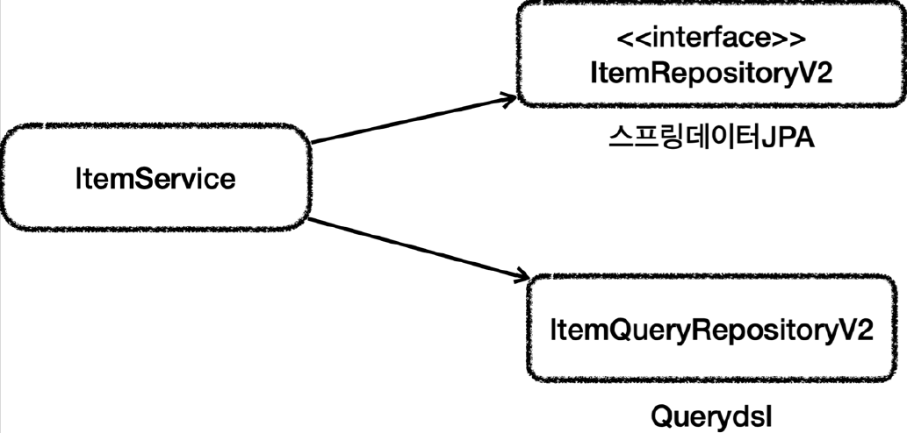

# <a href = "../README.md" target="_blank">스프링 DB 2편 - 데이터 접근 활용 기술</a>
## Chapter 08. 데이터 접근 기술 - 활용 방안
### 8.2 실용적인 구조
1) 스프링 데이터 JPA + Querydsl
2) ItemRepositoryV2 : 스프링 데이터 JPA
3) ItemQueryRepositoryV2 : Querydsl
4) ItemServiceV2
5) 서비스, 리포지토리 설정 변경 - V2Config
6) 테스트 및 애플리케이션 실행
7) 다른 방안 : 커스텀 리포지토리

---

# 8.2 실용적인 구조

---

## 1) 스프링 데이터 JPA + Querydsl



- ItemRepositoryV2 : 스프링 데이터 JPA의 기능을 제공하는 리포지토리이다.
- ItemQueryRepositoryV2 : Querydsl을 사용해서 복잡한 쿼리 기능을 제공하는 리포지토리이다.
- 이렇게 둘을 분리하면 기본 CRUD와 단순 조회는 스프링 데이터 JPA가 담당하고, 복잡한 조회 쿼리는 Querydsl이 담당하게 된다.
- 다만, ItemService 는 기존 ItemRepository 를 사용할 수 없기 때문에 코드를 변경해야 한다.


## 2) ItemRepositoryV2 : 스프링 데이터 JPA
```java
public interface ItemRepositoryV2 extends JpaRepository<Item, Long> {

}
```
- ItemRepositoryV2 는 JpaRepository 를 인터페이스 상속 받아서 스프링 데이터 JPA의 기능을 제공하는 리포지토리가 된다.
- 기본 CRUD는 이 기능을 사용하면 된다.
- 여기에 추가로 단순한 조회 쿼리들을 추가해도 된다.

---

## 3) ItemQueryRepositoryV2 : Querydsl
```java
@Repository
public class ItemQueryRepositoryV2 {

    private final JPAQueryFactory query;

    public ItemQueryRepositoryV2(EntityManager em) {
        this.query = new JPAQueryFactory(em);
    }

    public List<Item> findAll(ItemSearchCond cond) {
        // 생략
    }
}
```
- ItemQueryRepositoryV2 는 Querydsl을 사용해서 복잡한 쿼리 문제를 해결한다.
- Querydsl을 사용한 쿼리 문제에 집중되어 있어서, 복잡한 쿼리는 이 부분만 유지보수 하면 되는 장점이 있다.
- 예외 추상화는 `@Repository`에 위임한다.

---

## 4) ItemServiceV2
```java
@Service
@RequiredArgsConstructor
@Transactional
public class ItemServiceV2 implements ItemService {

    private final ItemRepositoryV2 itemRepositoryV2;
    private final ItemQueryRepositoryV2 itemQueryRepositoryV2;
    
    // 생략
}
```
- 기존 `ItemServiceV1` 코드를 남겨두기 위해서 `ItemServiceV2` 를 만들었다.
- `ItemServiceV2` 는 `ItemRepositoryV2` 와 `ItemQueryRepositoryV2` 를 의존한다.

---

## 5) 서비스, 리포지토리 설정 변경 - V2Config

### 5.1 설정 생성
```java
@Configuration
@RequiredArgsConstructor
public class V2Config {

    private final EntityManager em;
    private final ItemRepositoryV2 itemRepositoryV2; // Spring-Data-JPA가 프록시 구현체를 등록

    @Bean
    public ItemService itemService() {
        return new ItemServiceV2(itemRepositoryV2, itemQueryRepositoryV2());
    }

    @Bean
    public ItemQueryRepositoryV2 itemQueryRepositoryV2() {
        return new ItemQueryRepositoryV2(em);
    }

    /**
     * 확인용 초기 데이터 추가를 위해 빈으로 남겨둠
     */
    @Bean
    public ItemRepository itemRepository() {
        return new JpaItemRepositoryV3(em);
    }

}
```
- `ItemServiceV2` 를 등록한 부분을 주의하자. `ItemServiceV1` 이 아니라 `ItemServiceV2` 이다.
- `ItemRepository` 는 테스트에서 사용하므로 여전히 필요하다.

### 5.2 설정 적용
```java
@Slf4j
//@Import(QuerydslConfig.class)
@Import(V2Config.class)
@SpringBootApplication(scanBasePackages = "hello.itemservice.web")
public class ItemServiceApplication {
```
- `V2Config` 를 사용하도록 변경했다.

---

## 6) 테스트 및 애플리케이션 실행

## 6.1 테스트 실행
- `ItemRepositoryTest` 를 통해서 리포지토리가 정상 동작하는지 확인해본다.
- 하지만 의미 없는 테스트다.
  - 테스트는 `ItemRepository` 를 테스트 하는데, 현재 `JpaItemRepositoryV3` 가 스프링 빈으로 등록되어 있다.
  - `V2Config` 에서 사용한 리포지토리를 테스트 하려면 `ItemQueryRepositoryV2` , `ItemRepositoryV2` 용 테스트가 별도로 필요하다.

## 6.2 애플리케이션 실행
- `ItemServiceApplication` 를 실행해서 애플리케이션이 정상 동작하는지 확인해보자.
- 애플리케이션은 ItemServiceV2 를 사용한다.

---

## 7) 다른 방안 : 커스텀 리포지토리
- 스프링 데이터 JPA가 제공하는 커스텀 리포지토리를 사용해도 비슷하게 문제를 해결할 수는 있다.
- 이는 Spring Data JPA 강의를 참고하도록 하자.

---

