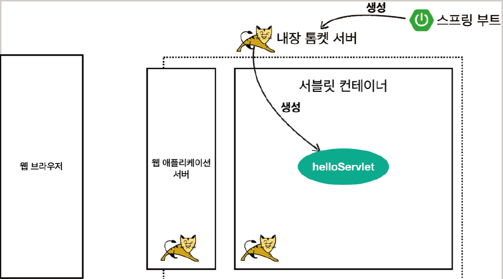
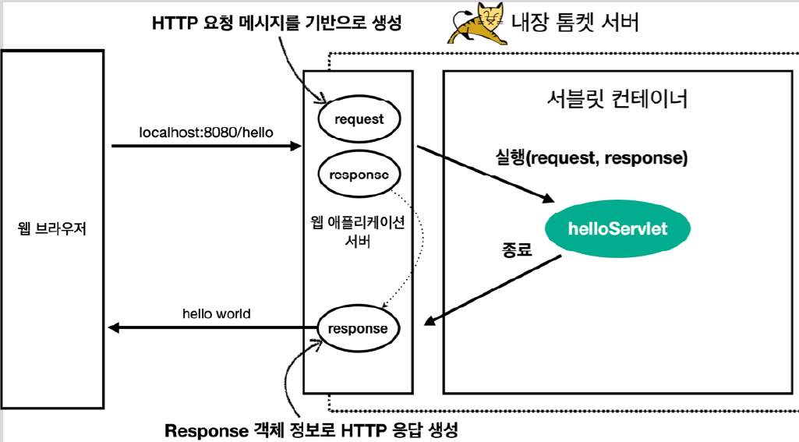

# <a href = "../README.md" target="_blank">스프링 MVC 1편 - 백엔드 웹 개발 핵심 기술</a>
## Chapter 02. 서블릿
### 2.02 Hello 서블릿
1) 기본적인 서블릿 환경 구성 방법
2) 스프링 부트에서 서블릿 자동 스캔 : `@ServletComponentScan`
3) 서블릿 등록하기 : `@WebServlet`, `extends HttpServlet`
4) 서블릿 실행하기
5) Http 요청 메시지 전체를 로깅하는 방법
6) 서블릿 컨테이너 동작 방식 설명
7) welcome 페이지 추가

---

# 2.02 Hello 서블릿

---

## 1) 기본적인 서블릿 환경 구성 방법
- 서블릿은 톰캣 같은 웹 애플리케이션 서버를 직접 설치하고, 그 위에 서블릿 코드를 클래스 파일로 빌드해서 올린 다음, 톰캣 서버를 실행하면 된다.
- 하지만 이 과정은 매우 번거롭다.
- 스프링 부트는 톰캣 서버를 내장하고 있으므로, 톰캣 서버 설치 없이 편리하게 서블릿 코드를 실행할 수 있다.

---

## 2) 스프링 부트에서 서블릿 자동 스캔 : `@ServletComponentScan`
```java
@ServletComponentScan // 서블릿 자동 등록
@SpringBootApplication
public class ServletApplication {
```
- 스프링 부트는 서블릿을 직접 등록해서 사용할 수 있도록 `@ServletComponentScan` 을 지원한다.
- 위와 같이 사용하면 된다.
- 물론 스프링 MVC를 사용한다면 위 방식으로 사용할 일은 거의 없을 것이다.

---

## 3) 서블릿 등록하기 : `@WebServlet`, `extends HttpServlet`

### 3.1 클래스 선언부
```java
@WebServlet(name = "helloServlet", urlPatterns = "/hello") // "/hello" 요청이 오면 실행됨
public class HelloServlet extends HttpServlet {
```
- `@WebServlet` 서블릿 애노테이션
  - `name` : 서블릿 이름
  - `urlPatterns` : URL 매핑
- 추상 클래스 `HttpServlet`의 `service` 메서드를 구현해야한다.

### 3.2 service 메서드 구현
```java
    @Override
    protected void service(HttpServletRequest request, HttpServletResponse response) throws ServletException, IOException {
        System.out.println("HelloServlet.service");
        System.out.println("request = " + request);
        System.out.println("response = " + response);

        String username = request.getParameter("username"); // 요청의 QueryParameter를 가져옴
        System.out.println("username = " + username);

        response.setContentType("text/plain"); // 응답 : 단순문자열 -> HttpResponse Header
        response.setCharacterEncoding("utf-8"); // 문자 인코딩 : utf-8 -> HttpResponse Header
        response.getWriter().write("hello, " + username); // HttpResponse Body에 데이터 전달
    }
```
- Http 요청을 통해 매핑된 URL이 호출되면, 서블릿 컨테이너는 이 메서드를 호출한다.
- 예제에서는 어떤 `HttpServletRequest`, `HttpServletResponse` 구현체가 들어왔는 지, 요청 파라미터를 읽어들이는지, 응답을 잘 할 수 있는지 간단한 작동을 눈으로 확인하기 위해 짜여졌다.
- 브라우저 상에서는 파라미터로 넘어온 값을 기반으로 "hello, 파라미터"를 응답할 것이다.

---

## 4) 서블릿 실행하기

### 4.1 웹 브라우저 실행

- http://localhost:8080/hello?username=world
- 결과: "hello, world"

### 4.2 콘솔 실행 결과
```shell
HelloServlet.service
request = org.apache.catalina.connector.RequestFacade@58b5bbc8
response = org.apache.catalina.connector.ResponseFacade@6406d410
username = world
```
- `org.apache.catalina.connector.RequestFacade` : 톰캣에서의 `HttpServletRequest` 표준스펙 인터페이스 구현체
- `org.apache.catalina.connector.ResponseFacade` : 톰캣에서의 `HttpServletResponse` 표준스펙 인터페이스 구현체

### 4.3 주의
- IntelliJ 무료 버전을 사용하는데, 서버가 정상 실행되지 않는다면 프로젝트 생성 IntelliJ Gradle 대신에 자바 직접 실행에 있는 주의 사항을 읽어보자.

---

## 5) Http 요청 메시지 전체를 로깅하는 방법

### 5.1 `main/resources/application.properties`
```properties
logging.level.org.apache.coyote.http11=debug
```
- `application.properties`에 위 설정을 추가하면 요청 메시지를 로그로 확인할 수 있다.

### 5.2 실제 실행
```shell
... o.a.coyote.http11.Http11InputBuffer      : Received [GET /favicon.ico HTTP/1.1
Host: localhost:8080
Connection: keep-alive
sec-ch-ua: "Chromium";v="104", " Not A;Brand";v="99", "Google Chrome";v="104"
sec-ch-ua-mobile: ?0
User-Agent: Mozilla/5.0 (Windows NT 10.0; Win64; x64) AppleWebKit/537.36 (KHTML, like Gecko) Chrome/104.0.0.0 Safari/537.36
sec-ch-ua-platform: "Windows"
Accept: image/avif,image/webp,image/apng,image/svg+xml,image/*,*/*;q=0.8
Sec-Fetch-Site: same-origin
Sec-Fetch-Mode: no-cors
Sec-Fetch-Dest: image
Referer: http://localhost:8080/hello?username=world
Accept-Encoding: gzip, deflate, br
Accept-Language: ko,en;q=0.9,ko-KR;q=0.8,en-US;q=0.7,ja;q=0.6,und;q=0.5
Cookie: Idea-29e03994=8ef711a7-377d-4610-b893-11112e6bceb5; Webstorm-e4baea9a=e2ff7fde-752a-4b79-a375-9f4b0423c143

]
```
서버를 다시 시작하고, 요청해보면 서버가 받은 HTTP 요청 메시지를 출력하는 것을 확인할 수 있다.

### 5.3 성능 저하 주의
- 운영서버에 이렇게 모든 요청 정보를 다 남기면 성능저하가 발생할 수 있다.
- 개발 단계에서만 적용하자.

---

## 6) 서블릿 컨테이너 동작 방식 설명

### 6.1 스프링 부트의 서블릿 등록

- 스프링 부트는 내장 톰캣 서버를 생성한다.
- 내장 톰캣 서버는 코드로 작성된 서블릿을 서블릿 컨테이너에 싱글톤으로 등록한다.

### 6.2 Http 요청, 응답 메시지

- 웹 클라이언트로부터 Http 요청 메시지가 전달된다.
- WAS는 서블릿을 호출하여 요청을 기반으로 로직을 수행 후, Http 응답 메시지를 작성한다.
- (참고) HTTP 응답에서 Content-Length는 웹 애플리케이션 서버가 자동으로 생성해준다.

### 6.3 웹 애플리케이션 서버의 요청-응답 구조

- Http 요청 메시지를 기반으로 WAS는 `HttpServletRequest` 구현체를 생성한다.
- Http 응답 메시지를 작성하는데 사용할 `HttpServletResponse` 구현체도 생성한다.
- 요청 url에 매핑된 서블릿을 서블릿 컨테이너에서 찾아 실행 후, 로직을 수행한다.
- 로직 수행 후 WAS는 `response`에 기입된 정보를 기반으로 Http 응답 메시지를 생성하여 응답한다.

---

## 7) welcome 페이지 추가
지금부터 개발할 내용을 편리하게 참고할 수 있도록 `welcome` 페이지를 만들어둔다.

### 7.1 `index.html`
```html
<!DOCTYPE html>
<head>
    <meta charset="UTF-8">
    <title>Title</title>
</head>
<body>
<ul>
    <li><a href="basic.html">서블릿 basic</a></li>
</ul>
</body>
</html>
```
- `webapp` 경로에 `index.html` 을 두면 http://localhost:8080 호출시 `index.html` 페이지가 열린다.
- `basic.html`은 아래에서 후술.

### 7.2 `basic.html`
```html
<!DOCTYPE html>
<html>
<head>
    <meta charset="UTF-8">
    <title>Title</title>
</head>
<body>
<ul>
    <li>hello 서블릿
        <ul>
            <li><a href="/hello?username=servlet">hello 서블릿 호출</a></li>
        </ul>
    </li>
    <li>HttpServletRequest
        <ul>
            <li><a href="/request-header">기본 사용법, Header 조회</a></li>
            <li>HTTP 요청 메시지 바디 조회
                <ul>
                    <li><a href="/request-param?username=hello&age=20">GET -
                        쿼리 파라미터</a></li>
                    <li><a href="/basic/hello-form.html">POST - HTML Form</a></
                    li>
                    <li>HTTP API - MessageBody -> Postman 테스트</li>
                </ul>
            </li>
        </ul>
    </li>
    <li>HttpServletResponse
        <ul>
            <li><a href="/response-header">기본 사용법, Header 조회</a></li>
            <li>HTTP 응답 메시지 바디 조회
                <ul>
                    <li><a href="/response-html">HTML 응답</a></li>
                    <li><a href="/response-json">HTTP API JSON 응답</a></li>
                </ul>
            </li>
        </ul>
    </li>
</ul>
</body>
</html>
```
- 이번 장에서 학습할 서블릿의 기본 사용방법을 참고하기 편리하도록 모아두었다.

---
