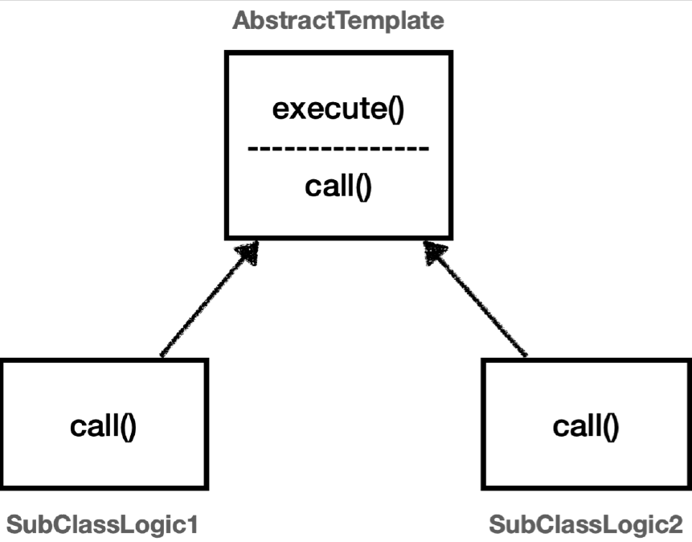
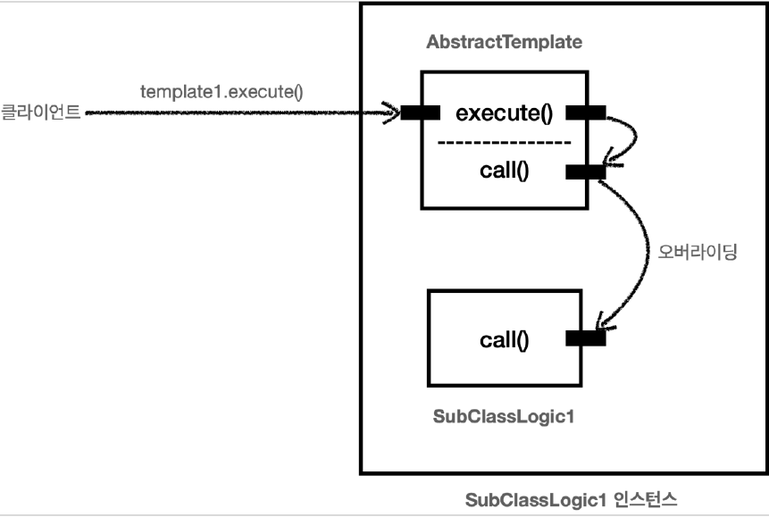

# <a href = "../README.md" target="_blank">스프링 핵심 원리 - 고급편</a>
## Chapter 03. 템플릿 메서드 패턴과 콜백 패턴
### 3.03 템플릿 메서드 패턴 - 예제2
1) 템플릿 메서드 패턴(Template Method Pattern)
2) 추상 클래스를 통해 전체 틀을 정해두고, 변하는 부분을 하위 클래스에서 구현한다.
3) `templateMethodV1` : 템플릿 메서드 패턴 적용
4) 템플릿 메서드 패턴의 인스턴스 호출 과정

---

# 3.03 템플릿 메서드 패턴 - 예제2

---

## 1) 템플릿 메서드 패턴(Template Method Pattern)


- 템플릿 메서드 패턴은 이름 그대로 템플릿을 사용하는 방식이다.
- 템플릿은 기준이 되는 거대한 틀이다.
- 템플릿이라는 틀에 변하지 않는 부분을 몰아둔다. 그리고 일부 변하는 부분을 별도로 호출해서 해결한다.
- 템플릿 메서드 패턴은 부모 클래스에 변하지 않는 템플릿 코드를 둔다. 그리고 변하는 부분은 자식 클래스에
  두고 상속과 오버라이딩을 사용해서 처리한다.
- 즉 템플릿 메서드 패턴은 상속과 다형성을 이용하여 변하는 부분과 변하지 않는 부분을 분리하는 방법이다.

---

## 2) 추상 클래스를 통해 전체 틀을 정해두고, 변하는 부분을 하위 클래스에서 구현한다.

### 2.1 AbstractTemplate
```java
@Slf4j
public abstract class AbstractTemplate {
    public void execute() {
        long startTime = System.currentTimeMillis();
        // 비즈니스 로직 실행
        call(); // 상속
        // 비즈니스 로직 종료
        long endTime = System.currentTimeMillis();
        long resultTime = endTime - startTime;
        log.info("resultTime = {}", resultTime);
    }

    protected abstract void call();
}
```
- `AbstractTemplate` 코드를 보자. 변하지 않는 부분인 시간 측정 로직을 몰아둔 것을 확인할 수 있다. 이제
  이것이 하나의 템플릿이 된다.
- 그리고 템플릿 안에서 변하는 부분은 `call()` 메서드를 호출해서 처리한다.

### 2.2 SubClassLogic1, SubClassLogic2
```java
@Slf4j
public class SubClassLogic1 extends AbstractTemplate {

    @Override
    protected void call() {
        log.info("비즈니스 로직1 실행");
    }
}
```
```java

@Slf4j
public class SubClassLogic2 extends AbstractTemplate {

    @Override
    protected void call() {
        log.info("비즈니스 로직2 실행");
    }
}

```
- 변하는 부분인 비즈니스 로직(로직1, 로직2, ...)을 처리하는 자식 클래스들이다.
- 템플릿이 호출하는 대상인 `call()` 메서드를 오버라이딩 한다.

---

## 3) `templateMethodV1` : 템플릿 메서드 패턴 적용
```java
    @Test
    void templateMethodV1() {
        AbstractTemplate template1 = new SubClassLogic1();
        template1.execute();

        AbstractTemplate template2 = new SubClassLogic2();
        template2.execute();
    }
```
```shell
비즈니스 로직1 실행
resultTime=0
비즈니스 로직2 실행
resultTime=1
```
- 이전과 동일한 로그를 찍는 것을 확인할 수 있다.
- 겉으로 보이는 결과는 같지만, 변하지 않는 로직(시간 측정)을 템플릿 한 곳에서 관리할 수 있게 됐다.

---

## 4) 템플릿 메서드 패턴의 인스턴스 호출 과정

- `template1.execute()` 를 호출하면 템플릿 로직인 `AbstractTemplate.execute()` 를 실행한다. 여기서
중간에 `call()` 메서드를 호출하는데, 이 부분이 오버라이딩 되어있다. 따라서 현재 인스턴스인
`SubClassLogic1` 인스턴스의 `SubClassLogic1.call()` 메서드가 호출된다.
- 템플릿 메서드 패턴은 이렇게 다형성을 사용해서 변하는 부분과 변하지 않는 부분을 분리하는 방법이다.

---
