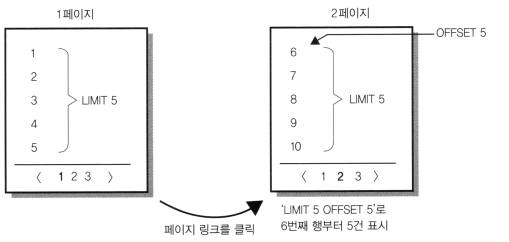

# <a href = "../README.md" target="_blank">SQL 첫걸음</a>
## Chapter 03. 정렬과 연산
### 11강. 결과 행 제한하기 - LIMIT
1) 결과 행 제한하기 - LIMIT
2) LIMIT는 SQL 표준이 아니다.
3) 오프셋 지정

---

# 11강. 결과 행 제한하기 - LIMIT

---

## 1) 결과 행 제한하기 - LIMIT

```mysql
SELECT 열명
FROM 테이블명
WHERE 조건식
LIMIT 행수;

-- 예시

SELECT *
FROM sample33
ORDER BY id DESC LIMIT 3;
```
- limit : 반환될 행수를 수치로 제한
- 검색 후, 정렬한뒤 제한한다.
  - where 구로 범위를 지정하는 방식은 애시당초 그만큼 검색을 하는 방식이라서 로직이 다르다.

## 2) LIMIT는 SQL 표준이 아니다.
- LIMIT는 SQL 표준이 아니기 때문에, MySQL, PostgreSQL 이외의 데이터베이스에서는 사용할 수 없다.
- SQLServer : TOP 뒤에 최대 행수를 지정
  ```sql
  SELECT TOP 3 * FROM sample33;
  ```
- Oracle : ROWNUM을 Where 구로 조건 지정
  ```oracle
  SELECT * FROM sample33 WHERE ROWNUM <=3;
  ```
  - 문제점 : LIMIT로 행을 제한한 경우와 결과값이 다르므로, 의도대로 쓰려면 서브쿼리를 복잡하게 사용해야함.

---

## 3) 오프셋 지정

```mysql
SELECT 열명
FROM 테이블명
LIMIT 행수 OFFSET 위치

-- 예시

SELECT *
FROM sample33
LIMIT 3 OFFSET 3;
```
- OFFSET : 데이터를 취득하기 시작할 위치를 지정할 수 있음
- 시작 위치 : 오프셋으로 지정한 위치 다음번부터 가져옴
  - 예) 3을 지정하면 4,5,6, ... 을 가져옴

---
