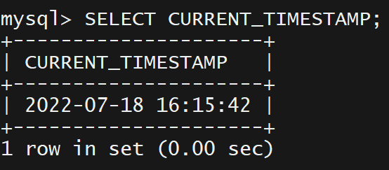

# <a href = "../README.md" target="_blank">SQL 첫걸음</a>
## Chapter 03. 정렬과 연산
### 14강. 날짜 연산
1) SQL에서의 날짜/시각
2) 시스템 날짜/시각 확인
3) 날짜/시각 서식 함수
4) 날짜/시각의 덧셈과 뺄셈
---

# 14강. 날짜 연산

---

## 1) SQL에서의 날짜/시각
- 각 데이터베이스 제품에 따라 날짜/시각 데이터를 저장하는 방법이 다름
- 날짜/시간을 전부 저장할 수 있는 자료형을 지원하거나, 각 날짜를 DATE, TIME, DATETIME과 같이 세분화하여 지원하는 데이터베이스 제품도 있음
- MySQL에서의 날짜, 시각
  - YEAR : 년
  - DATE : 년월일
  - TIME : 시분초, ms
  - DATETIME : 년월일, 시분초, ms
  - TIMESTAMP : 년월일, 시분초, ms

---

## 2) 시스템 날짜/시각 확인

```mysql
SELECT CURRENT_TIMESTAMP;
```

- 시스템 날짜 : 하드웨어 상의 시계로부터 실시간으로 얻을 수 있는 일시적인 시간 데이터
- 표준 SQL에서는 `CURRENT_TIMESTAMP` 함수를 실행했을 때 기준으로 시간을 표시
  - ORACLE 과 같은 전통적인 데이터베이스에서는 FROM 구를 생략할 수 없다.
- MySQL
  - CURRENT_TIMESTAMP : 현재 시각, 날짜
  - CURRENT_DATE : 현재 날짜
  - CURRENT_TIME : 현재 시각

---

## 3) 날짜/시각 서식 함수


- 날짜 서식은 국가별로 다르다.
  - 한국, 일본 : 연,월,일을 슬래시(`/`) 또는 하이픈(`-`)으로 구분해 표기
  - 미국 : 일,월,년 순으로 표기. 월을 Jan, Feb, ... 으로 표기
- 데이터베이스는 날짜 데이터의 서식을 임의로 지정, 변환할 수 있는 함수를 제공한다.
  - 문자열 -> 날짜
    - ORACLE : TO_DATE
    - MySQL : STR_TO_DATE
  - 날짜 -> 문자열
    - ORACLE : TO_CHAR
    - MySQL : DATE_FORMAT

---

## 4) 날짜/시각의 덧셈과 뺄셈

### 날짜/시간 ± 기간 = 날짜/시간

```sql
SELECT CURRENT_TIMESTAMP + INTERVAL 2 HOUR;
SELECT CURRENT_TIME - INTERVAL 1 MINUTE;
SELECT CURRENT_DATE + INTERVAL -1 DATE;
```
- 기간형 상수의 기술방법은 데이터베이스마다 조금씩 다르고 표준화 되지 않았으므로 데이터베이스의 메뉴얼을 참고해야함

### 날짜/시간 간의 뺼셈 = 기간

- ORACLE : `날짜 - 날짜` 으로 날짜 차를 구할 수 있음
- MySQL : DATEDIFF 함수로 날짜 차를 구할 수 있음
  - DATEDIFF(a, b) : a일에서 b일을 뺀 날짜 차

---