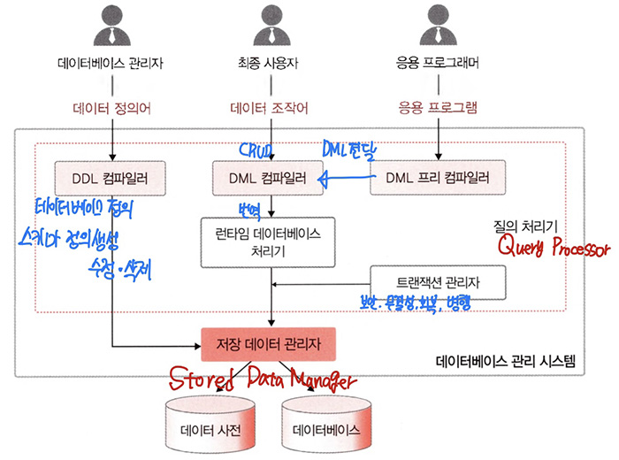

# <a href = "../README.md" target="_blank">데이터베이스 개론</a>
## Chapter 03. 데이터베이스 시스템의 정의
### 3.5 데이터베이스 관리 시스템의 구성
1) 질의 처리기(Query Processor)
2) 저장 데이터 관리자(Stored Data Manager)

---

# 3.5 데이터베이스 관리 시스템의 구성

데이터베이스 관리 시스템(DataBase Management System)
- 데이터베이스 관리
- 사용자, 응용 프로그램의 데이터 처리 요구를 수행 

---
 
## 1) 질의 처리기(Query Processor)
1. 질의 처리기(Query Processor)
   - 사용자의 데이터 처리 요구를 해석하여 처리하는 역할을 담당.
   - DDL 컴파일러, DML 프리 컴파일러, DML 컴파일러, 런타임 데이터베이스 처리기, 트랜잭션 관리자 등의 구성 요소들을 포함

2. DDL 컴파일러(DDL Compiler)
   - 데이터 정의어(DDL)로 작성된 스키마의 정의를 해석
   - 저장 데이터 관리자의 도움을 받아 새로운 데이터베이스를 구축하고, 스키마의 정의를 데이터 사전에 적용
   - 기존 스키마의 삭제나 수정 요청도 처리하여 변경된 내용을 데이터 사전에 적용
   
3. DML 프리 컴파일러(DML PreCompiler)
   - 응용 프로그램의 코드에 삽입된 데이터 조작어를 추출하여 DML 컴파일러에게 전달
   - DML과 관련 없는 코드들은 해당 언어의 컴파일러에게 전달

4. DML 컴파일러(DML Compiler)
   - DML로 작성된 데이터의 처리 요구(CRUD)를 분석
   - 런타임 데이터베이스 처리기가 이해할 수 있도록 해석하여 전달

5. 런타임 데이터베이스 처리기(Run-Time DataBase Processor)
   - 저장 데이터 관리자를 통해 데이터베이스에 접근하여, DML 컴파일러로부터 전달받은 데이터 처리 요구를 실제로 실행

6. 트랜잭션 관리자(Transaction Manager)
   - 보안 : 데이터베이스에 접근하는 과정에서 사용자의 접근 권한이 유효한지 검사
   - 무결성 유지 : 데이터베이스 무결성을 유지하기 위한 제약조건 위반 여부를 확인
   - 회복, 병행 수행과 관련된 작업 담당

---

## 2) 저장 데이터 관리자(Stored Data Manager)
- 저장 데이터 관리자 : 디스크에 저장된 데이터베이스(DB)/데이터 사전(DB Dictionary)을 관리하고, 실제 접근하는 역할
- 실제로 디스크에 저장된 파일에 접근하는 것은 운영체제(OS)의 기본 기능이므로, 저장 데이터 관리자는 운영체제의 도움을 받아 데이터베이스에 대한 접근을 수행함.

---