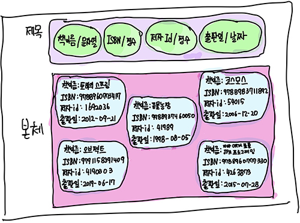

# <a href = "../README.md" target="_blank">데이터베이스 시스템</a>
## Chpater 02. 관계형 모델 소개
### 2.1 관계형 데이터베이스의 구조
1) 릴레이션
2) 도메인
3) 널 값(null value)
4) 엄격한 릴레이션 구조의 장단점

---

# 2.1 관계형 데이터베이스의 구조

---

## 1) 릴레이션

### 1.1 릴레이션
- SQL에서의 '테이블'에 대응되는 개념
- 파일 관리 시스템에서 '파일'에 대응됨

### 1.2 속성(Attribute)
- SQL에서 '열'에 대응되는 개념
- 파일 관리 시스템에서 '필드'에 대응됨
- 각각의 속성은 서로 다른 이름을 통해 구분
- 속성은 각각 도메인을 가지고 있는데, 아래에서 후술하겠지만, 일반적으로 속성의 특성을 고려하여 데이터 타입을 정의한다.

### 1.3 튜플(Tuple)
- SQL에서의 '행'에 대응되는 개념
- 파일 관리 시스템에서 '레코드'에 대응 됨
- 수학 : 간단한 값의 나열 또는 값의 리스트
- 속성의 정의에 따라 구성된 속성값의 집합
- 속성값들이 모임으로서 하나의 '관계(relationship)'를 표현한다.

---

## 2) 도메인

### 2.1 도메인이란?
- 어떤 속성에 대해서, 허가된 속성값들의 집합
- 예) 고객 릴레이션의 회원 등급 속성값으로 bronze, silver, gold, vip 중 하나만 허용된다면 회원 등급
속성의 도메인은 이들 네가지 값을 모아둔 것이 된다.

### 2.2 도메인은 원자적이여야한다.
- 도메인의 각 요소는 더 이상 나뉠 수 없다.
- 예) 전화번호를 국가번호, 지역번호 등과 같이 나눠서 생각하면 이는 원자적이지 않다.

---

## 3) 널 값(null value)
- 알려지지 않거나 존재하지 않는 특별한 값
- 가능한 널 값은 제거하는 것이 좋다.
- 이 책에서는 왜 널 값을 사용하면 안 되는지 3.6절에서 다룬다.

---

## 4) 엄격한 릴레이션 구조의 장단점
- 장점 : 잘 정의된 정적인 응용에 적합하다.
- 단점 : 시간이 지나서 데이터뿐 아니라 데이터의 형, 구조가 변하는 응용에는 덜 적합하다.
- 따라서, 구조적 데이터의 효율성(장점), 구조가 이미 결정된 상황의 한계(단점) 양쪽을 모두 고려하여 좋은 균형점을
찾을 필요가 있다.

---
