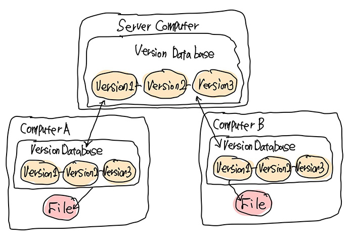

# <a href = "../../README.md" target="_blank">Git</a>
## <a href = "README.md" target="_blank">Chpater 1. 시작하기</a>
### 1.1 버전 관리란?
1) 버전 관리 시스템
2) 원시적인 버전 관리
3) 로컬 버전 관리 시스템
4) 중앙집중식 버전 관리
5) 분산 버전 관리 시스템

---

# 1.1 버전 관리란?

## 1) 버전 관리 시스템
1. 버전 관리 시스템(Version Control System)
   - 파일의 변화를 시간에 따라 기록했다가, 나중에 특정 시점의 파일을 다시 꺼내올 수 있는 시스템
2. 장점
   - 각 파일을 이전 상태로 되돌릴 수 있다.
   - 프로젝트를 통째로 이전 상태로 되돌릴 수 있다.
   - 시간에 따라 수정 내용을 비교해볼 수 있다.
   - 누가 문제를 일으켰는지, 누가 언제 만들어낸 이슈인지 확인할 수 있다.
   - 파일을 잃어버리거나 잘못 고쳤을 때 쉽게 복구할 수 있다.
   - 큰 노력없이 이와 같은 장점들을 쉽게 이용할 수 있다.
3. 종류
   - 로컬 버전 관리 시스템 (LVCS, Local Version Control System)
   - 중앙집중식 버전관리 (CVCS, Centralized Version Control System)
   - 분산식 버전관리 시스템 (DVCS, Distributed Version Control System)
---

## 2) 원시적인 버전 관리
```
- 최종본.zip
- 진짜_최종본.zip
- 진짜_진짜_최종본.zip
- 진짜_리얼루다가_최종본.zip
- 211215_2255 수정본.zip
```
- 버전별로 디렉토리를 통채로 백업해둠.
- 디렉토리로 버전 폴더를 복사해서 자료를 가져옴.

- 문제점
  - 작업하던 디렉토리를 지워버리거나, 실수로 파일을 잘못 고치거나, 잘못 복사할 수 있음.
  - 중요 메타데이터에 대한 명시가 강제되지 않아서, 버전의 전후관계 및 작성자 정보 등을 확인하기 어려움
  - 변경 내역을 별도로 문서로 작성하면, 필요한 변경내역 및 전후관계를 확인할 수 있긴 하지만...
    - 폴더와 변경 내역의 정보가 떨어져 이를 별도로 확인하는 추가적인 시간적 비용 등이 발생함.
  - 버전간 변경관계를 유기적으로 확인하기 힘듬.

---

## 3) 로컬 버전 관리 시스템

- 간단한 데이터 베이스를 사용해서 파일의 변경정보 관리
- 대표적인 예 : RCS (Revision Control System)
  - 파일에서 변경되는 부분(Patch Set)을 관리
  - Patch Set을 꺼내와서, 적용하여 모든 파일을 특정 시스템으로 되돌릴 수 있음.
- 단점
  - 로컬 디렉토리에서 관리하기만 하므로, 협업에 취약함

---

## 4) 중앙집중식 버전 관리


- 다른 개발자와 협업을 하는 것을 고려햐여, 서버에 버전을 올려두고 서버를 중심으로 버전 관리
- 동일한 히스토리를 중앙 서버에 저장해두고, 히스토리에서 특정 시점의 파일을 가져와서 작업
- 단점
  - 서버가 마비되면 협업을 할 수 없고, 작업본을 백업할 방법이 없음
  - 데이터베이스에 문제가 생겨버리면 프로젝트의 모든 히스토리를 상실함

---

## 5) 분산 버전 관리 시스템



1. 분산 버전 관리 시스템
   - 아무데서나 저장소를 생성하고, 어디든지 저장소 전체를 복제하는 방식
2. 장점
   - 서버에 이상이 생기더라도 복제물로 다시 작업을 계속할 수 있음.
   - 오프라인 환경에서도 개발을 계속할 수 있음.
   - 리모트 저장소(예 : github, 회사 서버, ...) 를 별도로 두어, 동시에 다양한 그룹과 협업을 할 수 있음.
3. 예 : Git, Mecurial, Bazzar, Darcs, ...
   
---

