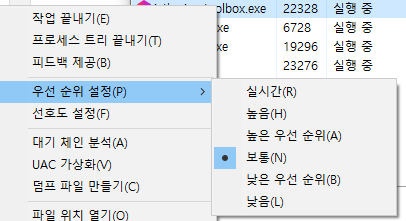

# <a href = "../README.md" target="_blank">Chapter 13. 스레드</a>
## 4. 스레드의 우선순위
### 4.1 스레드의 우선순위
1) priority
2) java에서 스레드의 우선순위 지정하기
3) 싱글코어에서의 우선순위
4) 멀티코어에서의 우선순위

---

# 4.1 스레드의 우선순위



## 1) priority
스레드는 각각 priority(우선순위)라는 속성를 가지고 있음. 이 우선순위에 따라 각 스레드가 얻는 실행시간의 양이 달라진다.
스레드가 수행하는 작업의 중요도에 따라, 스레드의 우선순위를 다르게 지정하여 특정 스레드가 더 많은 작업시간을 갖도록 할 수 있다.

---

## 2) java에서 스레드의 우선순위 지정하기
```
void setPriority(int newPriority)
int getPriority()
```
- 스레드의 우선순위 범위 : 1~10, 숫자가 높을 수록 우선순위가 더 높다.
- 스레드의 우선순위는 기본적으로 스레드를 생성한 스레드로부터 상속받음.
  - 메인스레드의 기본 우선순위는 5
- 정확히는 작업의 우선순위를 java application에서 지정하는 것이 아닌, OS 스케쥴러에 요청하는 것.

---

## 3) 싱글코어에서의 우선순위
1. OS에 각 스레드별 작업 우선순위 지정 요청  
2. OS의 스케쥴링에 의해 단일 코어에서 스레드별로 작업을 번갈아 수행하므로, 우선순위 설정에 따라 유의미한 시간 차이가 발생함.

---

## 4) 멀티코어에서의 우선순위
1. OS에 각 스레드별 작업 우선순위 지정 요청
2. 여러 코어에서 스레드별로 동시에 작업이 수행되는데, 우선순위 설정이 유의미한 시간차이를 확인할 수 없을 수 있음.

### 결론> OS와 JVM을 확인해봐야한다. 그래도 네가 확실히 제어하기 힘들거에요!
- 멀티코어라 하더라도, OS마다 다른 방식으로 스케쥴링.
- 스레드 제어는 OS가 담당하는 부분이므로, 어떤 OS에서 실행하느냐에 따라 다른 결과를 확인할 수 있음
- 우선순위에 차등을 두어 실행하려면, 각 OS별 스케쥴링 정책과 OS별 JVM의 우선순위 관련 구현을 직접 확인할 필요가 있음
- 그렇다 하더라도, OS의 스케쥴러님에 종속적이라서 어느 정도 예측만 가능할 뿐이지 정확히 알 수 없음.

- 더 확실한 처리방식 : 작업을 PrioriryQueue에 저장해두고 우선순위가 높은 작업이 먼저 처리되도록 하기

---