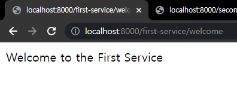

# <a href = "../README.md" target="_blank">Spring Cloud로 개발하는 마이크로서비스 애플리케이션(MSA)</a>
## Chapter 03. API Gateway Service
### 3.2 Netflix Zuul - 프로젝트 생성
1) First-Service, Second-Service
2) Zuul-Service
3) 실행

---

# 3.2 Netflix Zuul - 프로젝트 생성

---

## 1) First-Service, Second-Service

### 1.1 프로젝트 생성
- Dependencies : Lombok, Spring Web, Eureka Discovery Client

### 1.2 설정
```yaml
server:
  port: 8081

spring:
  application:
    name: my-first-service

eureka:
  client:
    register-with-eureka: false # 유레카에 등록 x
    fetch-registry: false # 유레카로부터 레지스트리 정보를 주기적으로 fetch 안 함
```
- first-service : 8081 / second-service : 8082
- spring.application.name
  - first : my-first-service
  - second : my-second-service

### 1.3 컨트롤러
```java
@RestController
@RequestMapping("/")
public class FirstServiceController {

    @GetMapping("/welcome")
    public String welcome() {
        return "Welcome to the First Service";
    }
}
```
```java
@RestController
@RequestMapping("/")
public class SecondServiceController {

    @GetMapping("/welcome")
    public String welcome() {
        return "Welcome to the Second Service";
    }
}
```
- 간단하게 `/welcome` 으로 접근하면 자신의 서비스 명을 출력하는 api를 개발했다.

---

## 2) Zuul-Service

### 2.1 프로젝트 생성
- Spring Boot : 2.3.8
  - 주의 : 2.4.0 이후 Zuul이 Maintenance 상태이므로, 이도원님의 GitHub에 올려진 프로젝트를 받아서 실습할 것
- Dependencies : Lombok, Spring Web, Zuul

### 2.2 application.yml
```yaml
server:
  port: 8000

spring:
  application:
    name: my-zuul-service

zuul:
  routes:
    first-service:
      path: /first-service/**
      url: http://localhost:8081
    second-service:
      path: /second-service/**
      url: http://localhost:8082
```
- 8000번 포트에 바인딩
- `/first-service/...`로 들어온 요청을 8081에, `/second-service/...`로 들어온 요청을 8082에 보낸다.

### 2.3 ZuulServiceApplication
```java
@SpringBootApplication
@EnableZuulProxy
public class ZuulServiceApplication {

    public static void main(String[] args) {
        SpringApplication.run(ZuulServiceApplication.class, args);
    }

}
```
- Zuul 프록시를 활성화하기 위해 `@EnableZuulProxy`를 적용
 
---

## 3) 실행

### 3.1 애플리케이션 3개 동시 구동 후 접속
- `http://localhost:8000/first-service/welcome`
- `http://localhost:8000/second-service/welcome`

### 3.2 결과



- 8000번 포트를 통해 `/first-service/welcome`, `/second-service/welcome`로 요청했더니
각각 8081의 `/welcome`, 8082의 `/welcome` api를 반환받은 것을 확인할 수 있다.

---
