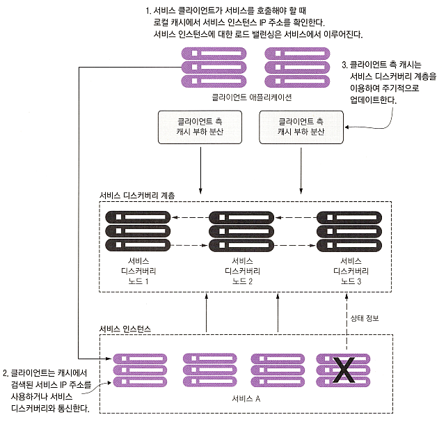

# <a href = "../README.md" target="_blank">Spring Cloud로 개발하는 마이크로서비스 애플리케이션(MSA)</a>
## Chapter 03. API Gateway Service
### 3.9 Spring Cloud Gateway - Load Balancer
1) Gateway, Eureka 연동
2) 클라이언트 사이드 로드 밸런싱

---

# 3.9 Spring Cloud Gateway - Load Balancer

---

## 1) Gateway, Eureka 연동

### 1.1 Gateway 측 설정
```yaml
server:
  port: 8000

eureka:
  client:
    register-with-eureka: true
    fetch-registry: true
    service-url:
      defaultZone: http://localhost:8761/eureka

spring:
  application:
    name: apigateway-service
  cloud:
    gateway:
      default-filters:
        - name: GlobalFilter
          args:
            baseMessage: Spring Cloud Gateway GlobalFilter
            preLogger: true
            postLogger: true
      routes:
        - id: first-service
          uri: lb://MY-FIRST-SERVICE

# 생략...

```
- Spring Cloud Gateway를 Eureka에 등록한다.
- register-with-eureka : 유레카에 등록
- fetch-registry : 유레카 레지스트리를 30초 간격으로 로컬에 fetch
- routes 설정에서, 각각의 요청을 서비스 디스커버리의 서비스명으로 포워딩하도록 함
  - 이 설정을 하면, 어디로 라우팅할 지 서비스 디스커버리를 거쳐 주소를 가져와 포워딩하도록 한다.

### 1.2 first/second service 설정
```yaml
server:
  port: 0

spring:
  application:
    name: my-first-service

eureka:
  client:
    register-with-eureka: true
    fetch-registry: true
    service-url:
      defaultZone: http://localhost:8761/eureka
  instance:
    instance-id: ${spring.application.name}:${spring.application.instance_id:${random.value}}

```
- 랜덤 포트에서 실행되게 함
- 유레카에 등록, 30초 간격으로 레지스트리를 fetch해오도록 함
  - 여기서 갖고 온 레지스트리를 로컬에 30초 간격으로 캐싱함으로서 다른 서비스 호출 시 시간을 절약할 수 있다.
- 랜덤 인스턴스 명을 갖도록 함

### 1.3 컨트롤러 설정
```java

@Slf4j
@RequiredArgsConstructor
@RestController
@RequestMapping("/first-service")
public class FirstServiceController {

    private final Environment env;
    
    // 생략

    @GetMapping("/check")
    public String check(HttpServletRequest request) {
        log.info("Server port = {}", request.getServerPort());
        return String.format(
                "Hi, there. This is a message from First Service. %s",
                env.getProperty("local.server.port")
        );
    }
}
```
- 요청이 들어올 때 실제 어느 인스턴스가 실행되는지 눈으로 확인하기 위해 컨트롤러의 check 메서드를 수정했다.
여기서는 서버 포트 정보를 얻어오는 2가지 방법 모두 예시를 들었다.
  - `Environment env` : 스프링 빈으로 등록됨. 실행 설정을 가져올 수 있다. `env.getProperty(...)`를 통해
  설정 정보를 가져올 수 있는데, 여기서는 서버 포트를 가져왔다.
  - `request.getServerPort()` : 서버 포트를 가져오는 또 다른 방법
- 로깅을 통해 서버 포트를 찍고, 응답으로 서버포트를 포함해서 응답하도록 했다.

---

## 2) 클라이언트 사이드 로드 밸런싱

### 2.1 유레카에 등록된 인스턴스


- 유레카 서버 기동 -> api 게이트웨이, first-service 2개, second-service 2개 기동
- 서비스 이름으로 각각의 주소가 추상화되었다.

### 2.2 실행
```shell
# postman 1번창
Hi, there. This is a message from First Service. 4764

# postman 2번창
Hi, there. This is a message from First Service. 4743
```
- `http://localhost:8000/first-service/check`
- postman의 2개 창을 띄워놓고 각각 같은 주소로 접근하면, port 주소가 다른 것을 확인할 수 있다.
- 서로 다른 포트 주소의 인스턴스로 로드 밸런싱이 된 것이다.

### 2.3 로드 밸런싱 원리


이 원리에 관해서는 스프링 클라우드 마이크로서비스 코딩콩작소 p.215 쯤에 설명이 되어 있다.
- 서비스 인스턴스는 자기 자신의 정보를 주기적으로 서비스 디스커버리 서비스에 push하거나, pull해옴.
- 정상상태를 전달하지 못 한 서비스는 가용 서비스 인스턴스 풀에서 제거되고, 서비스 레지스트리는 이를 갱신함.
- 클라이언트가 요청하는 모든 인스턴스에 대한 정보를 서비스 디스커버리 서비스와 소통한 후, 그 데이터를
클라이언트의 머신 로컬에 저장함.(캐싱)
- 클라이언트가 서비스를 호출할 때마다, 캐싱된 데이터를 통해 서비스 위치 정보를 검색함. 이 때
'라운드 로빈 부하 분산 알고리즘'과 같은 단순한 알고리즘을 사용하여 부하 분산이 이루어짐(클라이언트 사이드 로드 밸런싱)
- 클라이언트는 주기적으로 서비스 디스커버리 서비스와 소통하여, 서비스 인스턴스에 대한 캐시를 갱신한다.
클라이언트 캐시는 궁극적으로 일관적이지만 클라이언트가 비정상 서비스 인스턴스를 호출할 위험은 항상 존재한다.
  - 만약 이 과정에서 서비스 호출이 실패하면, 로컬 서비스 디스커버리 캐시가 무효화된다. 서비스 디스커버리 클라이언트는
  서비스 검색 에이전트에서 항목 갱신을 시도한다.

---
