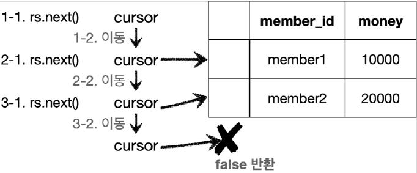

# <a href = "../README.md" target="_blank">스프링 DB 1편 - 데이터 접근 핵심 원리</a>

## Chapter 01. JDBC 이해

### 1.7 JDBC 개발 - 조회
1) DriverManager를 이용한 회원 조회 기능 구현(MemberRepositoryV0)
2) ResultSet의 내부 구조 및 사용 방법
3) 회원 등록, 조회 테스트(MemberRepositoryV0Test)
---

# 1.7 JDBC 개발 - 조회

---

## 1) DriverManager를 이용한 회원 조회 기능 구현(MemberRepositoryV0)

### 1.1 커넥션 획득 및 PreparedStatement 준비
```java
    public Member findById(String memberId) throws SQLException {
        String sql = "SELECT member_id, money\n" +
                "FROM member\n" +
                "WHERE member_id = ?"; // select문

        Connection conn = null;
        PreparedStatement pstmt = null;
        ResultSet rs = null;

        try {
            conn = getConnection(); // 커넥션 획득
        
            pstmt = conn.prepareStatement(sql);
            pstmt.setString(1, memberId);
            
            // 생략
```
- `sql` : 데이터를 조회하므로 SELECT 문을 작성

### 1.2 ResultSet 획득
```java
        rs = pstmt.executeQuery();
```
- `pstmt.executeQuery()`
  - 데이터를 조회할 때는 `executeQuery()` 를 사용
  - 데이터 조회 결과를 ResultSet 에 담아서 반환한다.
    ```java
    ResultSet executeQuery() throws SQLException;
    ```

### 1.3 ResultSet을 통해 결과 얻어오기
```java
            if (rs.next()) {
                return Member.builder()
                        .memberId(rs.getString("member_id"))
                        .money(rs.getInt("money"))
                        .build();
            } else {
                throw new NoSuchElementException(
                        String.format("Member Not Found : memberId= %s", memberId)
                );
            }
        } catch (SQLException e) {
            log.error("db error : {}", e);
            throw e;
        } finally {
            close(conn, pstmt, rs);
        }
    }
```

- `rs.next()` : 커서 이동 후 커서가 가리키는 행의 데이터 존재 여부 반환
  - true : 데이터가 있다.
  - false : 데이터가 없다.
- `rs.getString(...)`, `rs.getInt(...)` : 현재 커서가 가리키는 행에 위치하는 지정 칼럼의 데이터를 타입에 맞게 가져온다.

---

## 2) ResultSet의 내부 구조 및 사용 방법


- 보통 select 쿼리의 결과가 순서대로 들어간다.
    - `select member_id, money` 라고 지정하면 `member_id , money` 라는 이름으로 데이터가 저장
    - `select *` 을 사용하면 테이블의 모든 컬럼을 다 지정한다.
- ResultSet 내부에 있는 커서(`cursor`)를 이동해서 다음 데이터를 조회할 수 있다.
  - 최초의 커서는 데이터를 가리키고 있지 않기 때문에 rs.next() 를 최초 한번은 호출해야 데이터를 조회할 수 있음
- `rs.next()` : 커서를 다음으로 이동 후 커서가 가리키는 행의 데이터 존재 여부 반환
  - `true` : 데이터가 있다.
  - `false` : 데이터가 없다.
- 결과가 단건이면 "if 문"으로 감싸 처리하고, 여러건이면 "while 문"으로 처리한다.

---

## 3) 회원 등록, 조회 테스트(MemberRepositoryV0Test)
```java
@Test
@DisplayName("crud")
public void crud() throws Exception {
    Member member = new Member("memberV0", 10000);
    repository.save(member);

    //findById
    Member findMember = repository.findById(member.getMemberId());
    log.info("find Member = {}", findMember);
    assertThat(findMember).isEqualTo(member);
    assertThat(findMember.getMemberId()).isEqualTo(member.getMemberId());
    assertThat(findMember.getMoney()).isEqualTo(member.getMoney());
}
```
```
find Member = Member(memberId=memberV0, money=10000)
```
- 회원을 등록하고 그 결과를 바로 조회해서 프로퍼티를 비교하여 확인
  - 실행 결과에 member 객체의 참조 값이 아니라 실제 데이터가 보이는 이유는 롬복의 `@Data`가 `toString()`을 적절히 오버라이딩 해서 보여주기 때문이다.
  - `isEqualTo()` : findMember.equals(member) 를 비교한다. 결과가 참인 이유는 롬복의 `@Data`는 해당 객체의 모든 필드를 사용하도록 `equals()`를 오버라이딩 하기 때문이다.
  - 현재로서는 두 객체를 `==`비교로 하면 다른데, JPA를 사용하면 같은 영속성 컨텍스트에서 관리되기 때문에 `==` 비교시 참이 된다.
- 이 테스트는 2번 실행하면 PK 중복 오류가 발생한다. 이 경우 delete from member 쿼리로 데이터를 삭제한 다음에 다시 실행해야한다. **매우 불편하다. 테스트가 끝나고 롤백되도록 하는 방법이 필요하다.**
  ```
  org.h2.jdbc.JdbcSQLIntegrityConstraintViolationException: Unique index or
  primary key violation: "PUBLIC.PRIMARY_KEY_8 ON PUBLIC.MEMBER(MEMBER_ID) VALUES
  9"; SQL statement:
  ```

---
