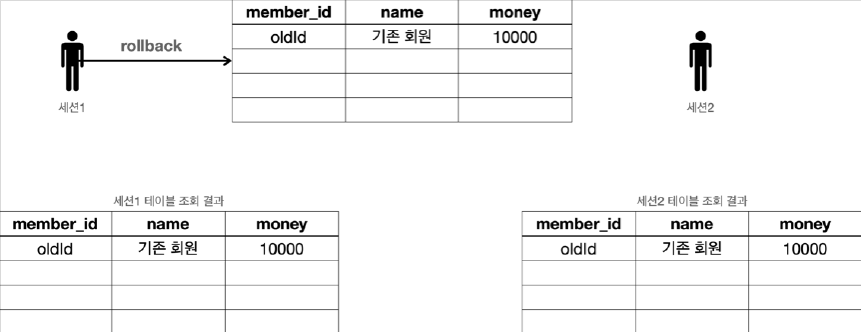

# <a href = "../README.md" target="_blank">스프링 DB 1편 - 데이터 접근 핵심 원리</a>
## Chapter 03. 트랜잭션 이해
### 3.03 트랜잭션 - DB 예제1 - 개념 이해
1) 트랜잭션 사용법
2) (예제) 세션1에서 신규 데이터 추가
3) 커밋하지 않은 데이터를 다른 곳에서 조회할 수 있을 때(READ UNCOMMITTED)
4) (예제) 세션1 신규 데이터 추가 후 commit
5) (예제) 세션1 신규 데이터 추가 후 rollback

---

# 3.03 트랜잭션 - DB 예제1 - 개념 이해

### 주의점
- 강의에서 진행되는 모든 내용들은 데이터베이스 격리수준이 **READ COMMITTED(커밋된 읽기)** 일 때다.
- READ COMMITTED에서는 다음 현상이 발생한다.
  - **Non-Repeatable Read** : 어떤 트랜잭션이 이전에 읽어들인 데이터를 다시 읽어들일 때 2회 이후의 결과가 1회 때와 다른 현상
  - **Phantom Read** : 선택할 수 있는(SELECT) 데이터가 나타나거나 사라지는 현상

---

## 1) 트랜잭션 사용법
- 데이터 변경 쿼리(등록, 수정, 삭제)를 실행하고
  - 데이터베이스에 그 결과를 반영하려면 커밋 명령어인 commit 을 호출
  - 결과를 반영하고 싶지 않으면 롤백 명령어인 rollback 을 호출
- 커밋을 호출하기 전까지는 임시로 데이터를 저장하는 것이다.
  - 해당 트랜잭션을 시작한 세션(사용자)에게만 변경 데이터가 보이고 다른 세션(사용자)에게는 변경 데이터가 보이지 않는다.
- 등록, 수정, 삭제 모두 같은 원리로 동작한다.

---

## 2) (예제) 세션1에서 신규 데이터 추가

### 2.1 기본 데이터

- 세션1, 세션2 둘다 가운데 있는 기본 테이블을 조회하면 해당 데이터가 그대로 조회된다.

### 2.2 데이터 삽입 후 커밋하지 않았을 때

세션1은 트랜잭션을 시작하고 신규 회원1, 신규 회원2를 DB에 추가했다. 아직 커밋은 하지 않은 상태이다.
- 새로운 데이터는 임시 상태로 저장된다.
- 세션1은 `select` 쿼리를 실행해서 본인이 입력한 신규 회원1, 신규 회원2를 조회할 수 있다.
- 세션2는 `select` 쿼리를 실행해도 신규 회원들을 조회할 수 없다. 왜냐하면 세션1이 아직 커밋을 하지 않았기 때문이다.

---

## 3) 커밋하지 않은 데이터를 다른 곳에서 조회할 수 있을 때(READ UNCOMMITTED)

1. 세션1에서 신규회원 1, 신규회원2를 삽입 후 커밋하지 않은 상황일 때 커밋하지 않는 데이터가 보인다면
   - 세션2는 데이터를 조회했을 때 신규 회원1, 2가 보일 것이다.
   - 세션2는 신규 회원1, 신규 회원2가 있다고 가정하고 어떤 로직을 수행할 수 있다. 

2. 그런데 세션1이 롤백을 수행하면 신규 회원1, 신규 회원2의 데이터가 사라지게 된다. 데이터 정합성에 큰 문제가 발생한다.
   - 세션2에서 세션1이 아직 커밋하지 않은 변경 데이터가 보이다면, 세션1이 롤백 했을 때 심각한 문제가 발생할 수 있다.

3. 커밋 전의 데이터는 다른 세션에서 보이지 않도록 격리수준(최소 READ COMMITTED)을 설정해야한다.

---

## 4) (예제) 세션1 신규 데이터 추가 후 commit

- 세션1이 신규 데이터를 추가한 후에 `commit`을 호출했다.
- `commit`으로 새로운 데이터가 실제 데이터베이스에 반영된다.
  - 데이터의 상태도 임시에서, 완료로 변경되었다.
- 이제 다른 세션에서도 회원 테이블을 조회하면 신규 회원들을 확인할 수 있다.(`Phantom Read`)

---

## 5) (예제) 세션1 신규 데이터 추가 후 rollback

- 세션1이 신규 데이터를 추가한 후에 `commit` 대신에 `rollback` 을 호출했다.
- 세션1이 데이터베이스에 반영한 모든 데이터가 처음 상태로 복구된다.
- 수정하거나 삭제한 데이터도 rollback 을 호출하면 모두 트랜잭션을 시작하기 직전의 상태로 복구된다.

---
