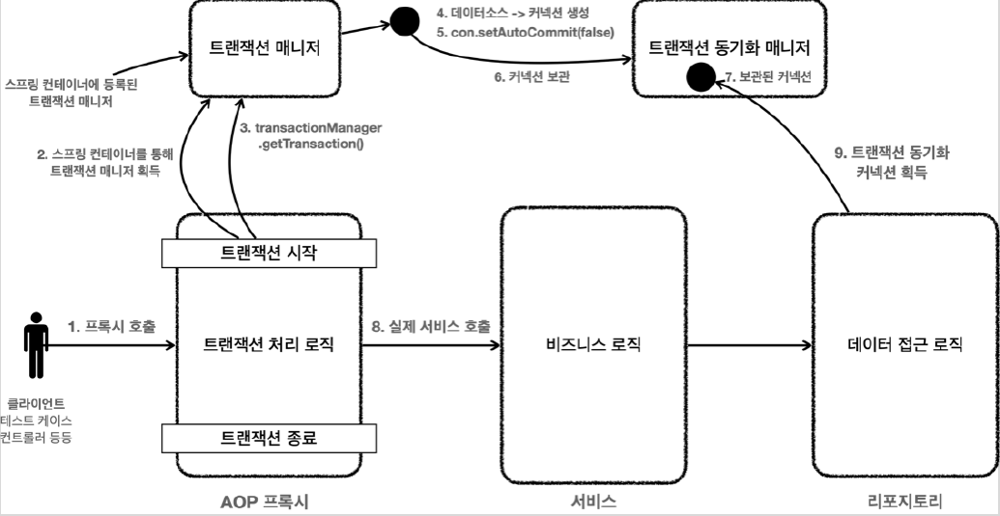

# <a href = "../README.md" target="_blank">스프링 DB 1편 - 데이터 접근 핵심 원리</a>
## Chapter 04. 스프링과 문제 해결 - 트랜잭션
### 4.09 트랜잭션 문제 해결 - 트랜잭션 AOP 정리
1) 트랜잭션 AOP 전체 흐름
2) 선언적 트랜잭션 관리 vs 프로그래밍 방식 트랜잭션 관리
3) 결론 : 트랜잭션 관련 코드를 순수한 비즈니스 로직에서 제거
---

# 4.09 트랜잭션 문제 해결 - 트랜잭션 AOP 정리

---

## 1) 트랜잭션 AOP 전체 흐름



### 1.1 스프링 AOP를 적용하려면 스프링 빈으로 등록해야함
```java
    @Bean
    DataSource dataSource() {
        return new DriverManagerDataSource(URL, USERNAME, PASSWORD);
    }

    @Bean
    PlatformTransactionManager transactionManager() {
        return new DataSourceTransactionManager(dataSource());
    }

    @Bean
    MemberRepositoryV3 memberRepositoryV3() {
        return new MemberRepositoryV3(dataSource());
    }

    @Bean
    MemberServiceV3_3 memberServiceV3_3() {
        return new MemberServiceV3_3(memberRepositoryV3());
    }
```
- 스프링 AOP를 적용하려면 대상 클래스를 빈으로 등록해야한다.
- 트랜잭션 매니저를 추상화했으므로, 트랜잭션 매니저 및 datasource를 빈으로 등록해놔야한다.
- 서비스 클래스는 실제 클래스로 등록되지 않고 원래 클래스를 상속한 가짜 프록시 객체가 빈으로 등록된다.

### 1.2 실제 호출되는건 AOP 프록시
```shell
memberService class = class ttasjwi.jdbc.service.MemberServiceV3_3$$EnhancerBySpringCGLIB$$d52bd732
memberRepository class = class ttasjwi.jdbc.repository.MemberRepositoryV3
```
- 서비스 계층은 실제로 가짜 프록시 클래스로 빈이 등록되어 있음

### 1.3 트랜잭션 매니저, 트랜잭션 동기화 매니저의 로직이 추상화됨
- AOP 프록시는 스프링 빈으로 등록된 트랜잭션 매니저를 의존하고 있다.
- 트랜잭션 매니저는 내부적으로 트랜잭션 동기화를 통해 커넥션을 관리한다.
  - 이는 `ThreadLocal`을 기반으로 동작한다.
- 리포지토리 계층에서는 트랜잭션 동기화 매니저에서 관리되고 있는 커넥션을 획득해서 데이터베이스에 접근한다.


---

## 2) 선언적 트랜잭션 관리 vs 프로그래밍 방식 트랜잭션 관리

### 2.1 선언적 트랜잭션 관리(Declarative Transaction Management)
- `@Transactional` 애노테이션 하나만 선언해서 매우 편리하게 트랜잭션을 적용하는 것
- 선언적 트랜잭션 관리는 과거 XML에 설정하기도 했다. 이름 그대로 해당 로직에 트랜잭션을 적용하겠다 라고 어딘가에 선언하기만 하면 트랜잭션이 적용되는 방식이다.

### 2.2 프로그래밍 방식의 트랜잭션 관리(programmatic transaction management)
- 트랜잭션 매니저 또는 트랜잭션 템플릿 등을 사용해서 트랜잭션 관련 코드를 직접 작성하는 것

### 2.3 뭐 써요?
=- 선언적 트랜잭션 관리가 프로그래밍 방식에 비해서 훨씬 간편하고 실용적이기 때문에 실무에서는 대부분 선언적 트랜잭션 관리를 사용
- 프로그래밍 방식의 트랜잭션 관리는 스프링 컨테이너나 스프링 AOP 기술 없이 간단히 사용할 수 있지만 실무에서는 대부분 스프링 컨테이너와 스프링 AOP를 사용하기 때문에 거의 사용되지 않는다.
- 프로그래밍 방식 트랜잭션 관리는 테스트 시에 가끔 사용될 때는 있다.

---

## 3) 결론 : 트랜잭션 관련 코드를 순수한 비즈니스 로직에서 제거
- 서비스 로직에서 트랜잭션 관련 코드가 제거됨.
- 대신 AOP를 적용하기 위해 각각의 계층들을 스프링 빈으로 등록해야한다.
  - 하지만 자바라는 언어 자체가 사실상 스프링에 잡아먹힌 상황인지라 큰 문제는 되지 않는다.
- 개발자는 트랜잭션이 필요한 곳에 `@Transactional` 어노테이션 하나만 추가하면 된다.
  - 나머지는 스프링 트랜잭션 AOP가 자동으로 처리해준다.
- `@Transactional`의 자세한 사용법은 뒤에서 학습

---
