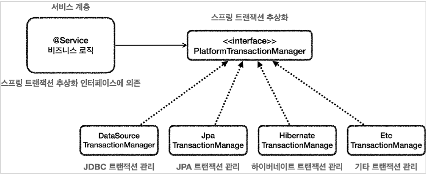
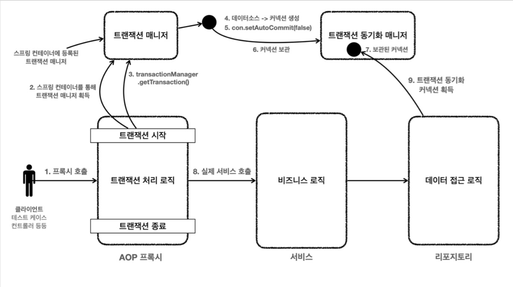

# <a href = "../README.md" target="_blank">스프링 DB 2편 - 데이터 접근 활용 기술</a>
## Chapter 09. 스프링 트랜잭션 이해
### 9.01 스프링 트랜잭션 소개
1) 스프링 트랜잭션 추상화
2) 스프링 트랜잭션 사용 방식
3) 선언적 트랜잭션과 AOP
4) 프록시 도입 후 전체 과정
5) 스프링이 제공하는 트랜잭션 AOP : `@Transactional`

---

# 9.01 스프링 트랜잭션 소개
- 본격적인 스프링 트랜잭션 기능 설명에 앞서 지금까지 학습한 스프링 트랜잭션을 간략히 복습하면서 정리한다.

---

## 1) 스프링 트랜잭션 추상화

### 1.1 데이터 접근기술마다 트랜잭션 처리 방식이 다르다.
```java
    public void accountTransfer(String fromId, String toId, int money) throws SQLException {
            Connection con = dataSource.getConnection();
            
            try {
                con.setAutoCommit(false); //트랜잭션 시작
                // 비즈니스 로직
                bizLogic(con, fromId, toId, money);
                con.commit(); //성공시 커밋
            } catch(Exception e){
                con.rollback(); //실패시 롤백
                throw new IllegalStateException(e);
            } finally {
                release(con);
            }
    }
```
```java
    public static void main(String[] args) {
        //엔티티 매니저 팩토리 생성
        // EntityManagerFactory emf =
        Persistence.createEntityManagerFactory("jpabook");
        EntityManager em = emf.createEntityManager(); //엔티티 매니저 생성
        EntityTransaction tx = em.getTransaction(); //트랜잭션 기능 획득
        try {
            tx.begin(); //트랜잭션 시작
            logic(em); //비즈니스 로직
            tx.commit();//트랜잭션 커밋
        } catch (Exception e) {
            tx.rollback(); //트랜잭션 롤백
        } finally {
            em.close(); //엔티티 매니저 종료
        }
        emf.close(); //엔티티 매니저 팩토리 종료
    }
```
- 각각의 데이터 접근 기술들마다 트랜잭션을 처리하는 방식에 차이가 있다.
- 예를 들어 JDBC 기술과 JPA 기술은 트랜잭션을 사용하는 코드 자체가 다르다.
- 따라서 JDBC 기술을 사용하다가 JPA 기술로 변경하게 되면 트랜잭션을 사용하는 코드도 모두 함께 변경해야 한다.

### 1.2 스프링의 트랜잭션 추상화 - `PlatformTransactionManager` 인터페이스
```java
package org.springframework.transaction;

public interface PlatformTransactionManager extends TransactionManager {
    
    TransactionStatus getTransaction(@Nullable TransactionDefinition definition) throws TransactionException;
    
    void commit(TransactionStatus status) throws TransactionException;
    
    void rollback(TransactionStatus status) throws TransactionException;
}
```
- 스프링은 `PlatformTransactionManager` 라는 인터페이스를 통해 트랜잭션을 추상화한다.
- 트랜잭션은 트랜잭션 시작(획득), 커밋, 롤백으로 단순하게 추상화 할 수 있다.

### 1.3 스프링의 트랜잭션 매니저 구현체 제공

- 스프링은 트랜잭션을 추상화해서 제공할 뿐만 아니라, 실무에서 주로 사용하는 데이터 접근 기술에 대한 트랜잭션 매니저의 구현체도 제공한다. 우리는 필요한 구현체를 스프링 빈으로 등록하고 주입 받아서 사용하기만 하면 된다.
- 여기에 더해서 스프링 부트는 어떤 데이터 접근 기술을 사용하는지를 자동으로 인식해서 적절한 트랜잭션 매니저를 선택해서 스프링 빈으로 등록해주기 때문에 트랜잭션 매니저를 선택하고 등락하는 과정도 생략할 수 있다.
- 예를 들어서 JdbcTemplate , MyBatis 를 사용하면 `DataSourceTransactionManager(JdbcTransactionManager)` 를 스프링 빈으로 등록하고, JPA를 사용하면 `JpaTransactionManager` 를 스프링 빈으로 등록해준다.
- (참고) 스프링 5.3부터는 JDBC 트랜잭션을 관리할 때 DataSourceTransactionManager 를 상속받아서 약간의 기능을 확장한 JdbcTransactionManager 를 제공한다. 둘의 기능 차이는 크지 않으므로 같은 것으로 이해하면 된다.


---

## 2) 스프링 트랜잭션 사용 방식
`PlatformTransactionManager` 를 사용하는 방법은 크게 2가지가 있다.

### 2.1 선언적 트랜잭션 관리(Declarative Transaction Management)
- `@Transactional` 어노테이션 하나만 선언해서 매우 편리하게 트랜잭션을 적용하는 것을 선언적 트랜잭션 관리라 한다.
- 선언적 트랜잭션 관리는 과거 XML에 설정하기도 했다. 
- 이름 그대로 해당 로직에 트랜잭션을 적용하겠다 라고 어딘가에 선언하기만 하면 트랜잭션이 적용되는 방식이다.
- 프로그래밍 방식의 트랜잭션 관리를 사용하게 되면, 애플리케이션 코드가 트랜잭션이라는 기술 코드와 강하게 결합된다.

### 2.2 프로그래밍 방식의 트랜잭션 관리(programmatic transaction management)
- 트랜잭션 매니저 또는 트랜잭션 템플릿 등을 사용해서 트랜잭션 관련 코드를 직접 작성하는 것을 프로그래밍 방식의 트랜잭션 관리라 한다.
- 선언적 트랜잭션 관리가 프로그래밍 방식에 비해서 훨씬 간편하고 실용적이기 때문에 실무에서는 대부분 선언적 트랜잭션 관리를 사용한다.

---

## 3) 선언적 트랜잭션과 AOP
`@Transactional` 을 통한 선언적 트랜잭션 관리 방식을 사용하게 되면 기본적으로 프록시 방식의 AOP가 적용된다.

### 3.1 프록시 도입 전 (프로그래밍 방식)

```java
    //트랜잭션 시작
    TransactionStatus status = transactionManager.getTransaction(new DefaultTransactionDefinition());
    try {
        //비즈니스 로직
        bizLogic(fromId, toId, money);
        transactionManager.commit(status); //성공시 커밋
    } catch (Exception e) {
        transactionManager.rollback(status); //실패시 롤백
        throw new IllegalStateException(e);
    }
```
트랜잭션을 처리하기 위한 프록시를 도입하기 전에는 서비스의 로직에서 트랜잭션을 직접 시작했다.

### 3.2 프록시 도입 후 (선언적 트랜잭션 관리 방식)


트랜잭션을 처리하기 위한 프록시를 적용하면 트랜잭션을 처리하는 객체와 비즈니스 로직을 처리하는 서비스 객체를 명확하게 분리할 수 있다.


### 3.3 트랜잭션 프록시 코드(예시)
```java
public class TransactionProxy {
    
    private MemberService target; // 실제 서비스

    public void logic() {
        //트랜잭션 시작
        TransactionStatus status = transactionManager.getTransaction(..);
        try {
            //실제 대상 호출
            target.logic();
            transactionManager.commit(status); //성공시 커밋
        } catch (Exception e) {
            transactionManager.rollback(status); //실패시 롤백
            throw new IllegalStateException(e);
        }
    }
}
```

### 3.4 트랜잭션 프록시 적용 후 서비스 코드 예시
```java
public class Service {
    public void logic() {
        //트랜잭션 관련 코드 제거, 순수 비즈니스 로직만 남음
        bizLogic(fromId, toId, money);
    }
}
```
- 프록시 도입 전: 서비스에 비즈니스 로직과 트랜잭션 처리 로직이 함께 섞여있다.
- 프록시 도입 후
  - 트랜잭션 프록시가 트랜잭션 처리 로직을 모두 가져간다. 그리고 트랜잭션을 시작한 후에 실제 서비스를 대신 호출한다.
  - 트랜잭션 프록시 덕분에 서비스 계층에는 순수한 비즈니즈 로직만 남길 수 있다.

---

## 4) 프록시 도입 후 전체 과정

- 트랜잭션은 커넥션에 `con.setAutocommit(false)` 를 지정하면서 시작한다.
- 같은 트랜잭션을 유지하려면 같은 데이터베이스 커넥션을 사용해야 한다. 
- 이것을 위해 스프링 내부에서는 트랜잭션 동기화 매니저가 사용된다.
- `JdbcTemplate` 을 포함한 대부분의 데이터 접근 기술들은 트랜잭션을 유지하기 위해 내부에서 트랜잭션 동기화 매니저를 통해 리소스(커넥션)를 동기화 한다.

---

## 5) 스프링이 제공하는 트랜잭션 AOP : `@Transactional`
- 스프링의 트랜잭션은 매우 중요한 기능이고, 전세계 누구나 다 사용하는 기능이다.
- 스프링은 트랜잭션 AOP 를 처리하기 위한 모든 기능을 제공한다
- 스프링 부트를 사용하면 트랜잭션 AOP를 처리하기 위해 필요한 스프링 빈들도 자동으로 등록해준다.
- 개발자는 트랜잭션 처리가 필요한 곳에 `@Transactional` 어노테이션만 붙여주면 된다.
  - `org.springframework.transaction.annotation.Transactional`
- 스프링의 트랜잭션 AOP는 이 어노테이션을 인식해서 트랜잭션을 처리하는 프록시를 적용해준다.

---

