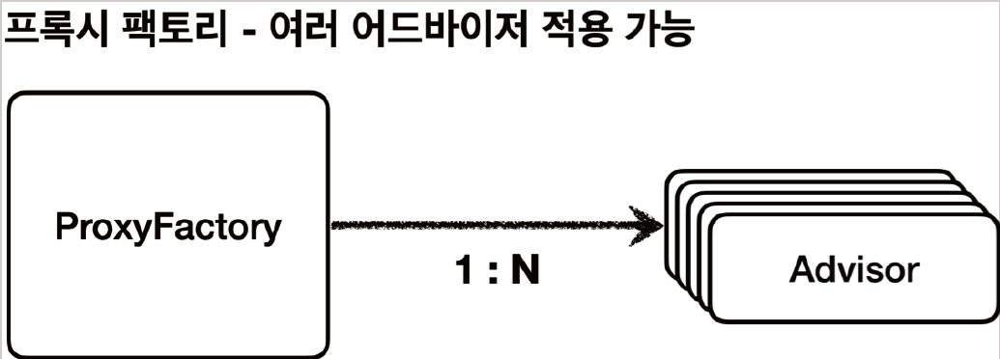

# <a href = "../README.md" target="_blank">스프링 핵심 원리 - 고급편</a>
## Chapter 06. 스프링이 지원하는 프록시
### 6.08 예제 코드4 - 여러 어드바이저 함께 적용
1) 여러 프록시를 생성하는 방식 (bad)
2) 하나의 프록시에 여러 어드바이저 등록(ProxyFactory, Spring AOP)
3) 스프링 AOP : 하나의 프록시에 여러 어드바이저가 적용된다.
---

# 6.08 예제 코드4 - 여러 어드바이저 함께 적용
- 어드바이저는 하나의 포인트컷과 하나의 어드바이스를 가지고 있다.
- 만약 여러 어드바이저를 하나의 `target` 에 적용하려면 어떻게 해야할까?
- 쉽게 이야기해서 하나의 `target` 에 여러 어드바이스를 적용하려면 어떻게 해야할까?
  
---

## 1) 여러 프록시를 생성하는 방식 (bad)
가장 먼저 떠오르는 방법은 프록시마다 어드바이저를 하나씩 적용해서, n개의 프록시를 생성하는 것이다.

### 1.1 (실습) 여러 어드바이스 정의
```java

    @Slf4j
    static class Advice1 implements MethodInterceptor {

        @Override
        public Object invoke(MethodInvocation invocation) throws Throwable {
            log.info("advice1 호출");
            return invocation.proceed();
        }
    }

    @Slf4j
    static class Advice2 implements MethodInterceptor {

        @Override
        public Object invoke(MethodInvocation invocation) throws Throwable {
            log.info("advice2 호출");
            return invocation.proceed();
        }
    }
```
- 간단하게 어드바이스 2개를 정의했다.

### 1.2 코드
```java
public class MultiAdvisorTest {

    @Test
    @DisplayName("여러 프록시")
    void multiAdvisorTest1() {
        // proxy2 (advisor2) -> proxy1(advisior1) -> target

        // 프록시1 생성
        ServiceInterface target = new ServiceImpl();
        ProxyFactory proxyFactory1 = new ProxyFactory(target);
        DefaultPointcutAdvisor advisor1 = new DefaultPointcutAdvisor(Pointcut.TRUE, new Advice1());
        proxyFactory1.addAdvisor(advisor1);
        ServiceInterface proxy1 = (ServiceInterface) proxyFactory1.getProxy();

        // 프록시2 생성
        ProxyFactory proxyFactory2 = new ProxyFactory(proxy1);
        DefaultPointcutAdvisor advisor2 = new DefaultPointcutAdvisor(Pointcut.TRUE, new Advice2());
        proxyFactory2.addAdvisor(advisor2);
        ServiceInterface proxy2 = (ServiceInterface) proxyFactory2.getProxy();

        //실행
        proxy2.save();
    }
}
```
- 프록시를 두개 생성한다. 한 프록시에는 `advice1`, 한 프록시에는 `advice2`를 적용한다.
  - 포인트컷은 `advisor1` , `advisor2` 모두 항상 `true` 를 반환하도록 설정했다. 모두 런타임에 메서드 호출 시, 어드바이스가
  적용된다.
- 프록시2가 프록시1을 알고 있고, 프록시1은 `target`을 알고 있다.
- 실제로 런타임에는 프록시2가 호출될 것이다.

### 1.3 런타임 의존관계

- 실제 런타임 의존관계를 그림으로 확인하면 위와 같다.

### 1.4 실행 결과
```shell
MultiAdvisorTest$Advice2 - advice2 호출
MultiAdvisorTest$Advice1 - advice1 호출
ServiceImpl - save 호출
```
- 프록시2에 적용된 advice1이 호출되고, 그 후 프록시1에 적용된 advice1이 호출되고, target의 메서드가 호출된다.

### 1.5 한계 : 프록시를 여러번 생성해야하는 불편함
- 이 방법이 잘못된 것은 아니지만, 프록시를 2번 생성해야 한다는 문제가 있다.
- 만약 적용해야 하는 어드바이저가 10개라면 10개의 프록시를 생성해야한다.

---

## 2) 하나의 프록시에 여러 어드바이저 등록(ProxyFactory, Spring AOP)

### 2.1 ProxyFactory : 한 프록시에 여러 어드바이저 등록 가능

스프링은 위의 문제를 해결하기 위해 하나의 프록시에 여러 어드바이저를 적용할 수 있게 만들어두었다.

### 2.2 코드
```java
    @Test
    @DisplayName("하나의 프록시, 여러 어드바이저")
    void multiAdvisorTest2() {
        // client -> proxy -> advisor2 -> advisor1 -> target
        DefaultPointcutAdvisor advisor1 = new DefaultPointcutAdvisor(Pointcut.TRUE, new Advice1());
        DefaultPointcutAdvisor advisor2 = new DefaultPointcutAdvisor(Pointcut.TRUE, new Advice2());

        // 프록시 생성
        ServiceInterface target = new ServiceImpl();
        ProxyFactory proxyFactory = new ProxyFactory(target);

        proxyFactory.addAdvisor(advisor2); // 어드바이저 등록 순서대로 수행된다.
        proxyFactory.addAdvisor(advisor1);

        ServiceInterface proxy = (ServiceInterface) proxyFactory.getProxy();

        //실행
        proxy.save();
    }
```
- 프록시 팩토리에 원하는 만큼 `addAdvisor()` 를 통해서 어드바이저를 등록하면 된다.
- 등록하는 순서대로 `advisor` 가 호출된다. 여기서는 `advisor2` , `advisor1` 순서로 등록했다.

### 2.3 런타임 객체 의존 관계

- 프록시는 우리가 등록한 순서대로 어드바이저를 갖고 있다.
- 런타임에 메서드를 호출하면, 어드바이저의 포인트컷을 통해 순서대로 적용 대상인지 확인하고 어드바이스의 로직을 호출하거나 호출하지 않은 뒤 다음으로 넘어간다.
- 순서대로 어드바이저를 모두 호출한 뒤 target의 로직이 호출된다.

### 2.4 실행 결과
```shell
MultiAdvisorTest$Advice2 - advice2 호출
MultiAdvisorTest$Advice1 - advice1 호출
ServiceImpl - save 호출
```
실행 결과를 보면 `advice2` , `advice1` 순서대로 호출된 것을 알 수 있다.

### 2.5 이익
- 같은 결과를 갖지만 여러 개의 프록시를 생성할 때보다 덜 번거롭고, 성능은 더 좋다.

---

## 3) 스프링 AOP : 하나의 프록시에 여러 어드바이저가 적용된다.
- 사실 이번 장을 이렇게 풀어서 설명한 이유가 있다.
- 스프링의 AOP를 처음 공부하거나 사용하면, AOP 적용 수 만큼 프록시가 생성된다고 착각하게 된다.
실제 많은 실무 개발자들도 이렇게 많이 생각한다.
- 스프링은 AOP를 적용할 때, 최적화를 진행해서 지금처럼 프록시는 하나만 만들고, 하나의 프록시에 여러
어드바이저를 적용한다.
- 정리하면 하나의 target 에 여러 AOP가 동시에 적용되어도, 스프링의 AOP는 target 마다 하나의
프록시만 생성한다. 이부분을 꼭 기억해두자.

---
