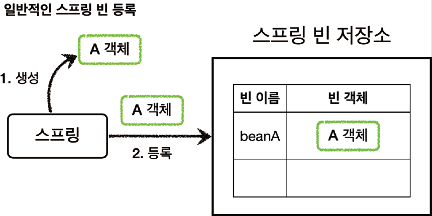

# <a href = "../README.md" target="_blank">스프링 핵심 원리 - 고급편</a>
## Chapter 07. 빈 후처리기
### 7.2 빈 후처리기 - 예제 코드1
1) 일반적인 빈 등록 과정 - BasicTest

---

# 7.2 빈 후처리기 - 예제 코드1

---

## 1) 일반적인 빈 등록 과정 - BasicTest

### 1.1 개요

빈 후처리기를 학습하기 전에 먼저 일반적인 스프링 빈 등록 과정을 코드로 작성하고 확인해본다.

### 1.2 BasicConfig
```java
    @Slf4j
    @Configuration
    static class BasicConfig {

        @Bean(name = "beanA")
        public A a () {
            return new A();
        }

    }

    @Slf4j
    static class A {
        public void helloA() {
            log.info("hello A");
        }
    }

    @Slf4j
    static class B {
        public void helloB() {
            log.info("hello B");
        }
    }
```
- beanA 라는 이름으로 A 객체를 스프링 빈으로 등록했다.
- B 클래스는 스프링 빈으로 등록하지 않았다.

### 1.3 BasicTest
```java
public class BasicTest {

    @Test
    void basicConfig() {
        ApplicationContext applicationContext = new AnnotationConfigApplicationContext(BasicConfig.class);

        //A는 빈으로 등록된다.
        A a = applicationContext.getBean("beanA", A.class);
        a.helloA();

        //B는 빈으로 등록되지 않는다.
        assertThatThrownBy(() -> applicationContext.getBean(B.class))
                .isInstanceOf(NoSuchBeanDefinitionException.class);
    }

}
```
- 스프링 컨테이너 생성 : `new AnnotationConfigApplicationContext(BasicConfig.class)`
  - 스프링 컨테이너를 생성하면서 `BasicConfig.class` 를 넘겨주었다.
  - `BasicConfig.class` 설정 파일은 스프링 빈으로 등록된다.
- 스프링 빈 조회
  - `A a = applicationContext.getBean("beanA", A.class)` : beanA 라는 이름으로 A 타입의 스프링 빈을 찾을 수 있다. 
  - `applicationContext.getBean(B.class)` : B 타입의 객체는 스프링 빈으로 등록한 적이 없기 때문에 스프링 컨테이너에서 찾을 수 없다.

---
