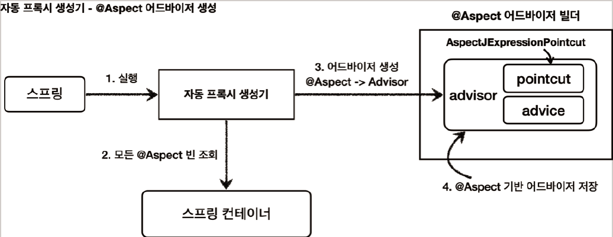
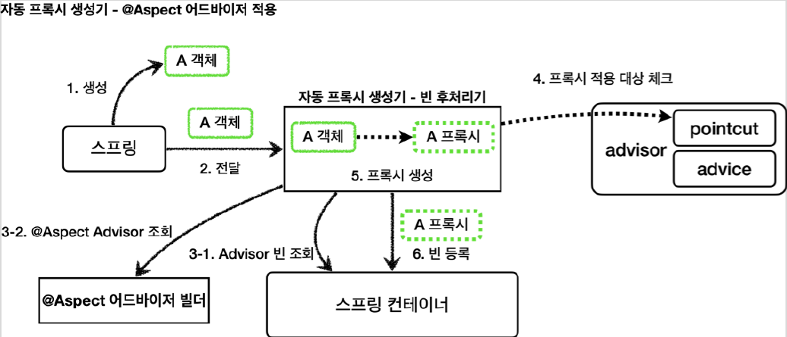

# <a href = "../README.md" target="_blank">스프링 핵심 원리 - 고급편</a>
## Chapter 08. @Aspect AOP
### 8.2 @Aspect 프록시 - 설명
1) 자동 프록시 생성기 : 어드바이저 기반 프록시 생성 + `@Aspect`로 어드바이저 변환 및 저장
2) `@Aspect` 를 어드바이저로 변환해서 저장하는 과정
3) 어드바이저를 기반으로 프록시를 생성하는 과정

---

# 8.2 @Aspect 프록시 - 설명

---

## 1) 자동 프록시 생성기 : 어드바이저 기반 프록시 생성 + `@Aspect`로 어드바이저 변환 및 저장 

### 1.1 어드바이저를 기반으로 프록시 생성
- 자동 프록시 생성기(AnnotationAwareAspectJAutoProxyCreator )는 Advisor 를 자동으로 찾아와서 필요한 곳에
프록시를 생성하고 적용해준다.

### 1.2 부가 기능 : `@Aspect` 인식 -> Advisor 변환 -> 저장
- 자동 프록시 생성기는 여기에 추가로 하나의 역할을 더 하는데, 바로
`@Aspect` 를 찾아서 이것을 Advisor 로 만들어준다.
- 쉽게 이야기해서 지금까지 학습한 기능에 `@Aspect` 를 `Advisor` 로 변환해서
저장하는 기능도 한다. 그래서 이름 앞에 `AnnotationAware`(어노테이션을 인식하는)가 붙어 있는 것이다. 

---

## 2) `@Aspect` 를 어드바이저로 변환해서 저장하는 과정

### 2.1 `@Aspect`를 어드바이저로 변환해서 저장하는 과정
1. 실행: 스프링 애플리케이션 로딩 시점에 자동 프록시 생성기를 호출한다.
2. 모든 `@Aspect` 빈 조회: 자동 프록시 생성기는 스프링 컨테이너에서 `@Aspect` 어노테이션이 붙은
   스프링 빈을 모두 조회한다.
3. 어드바이저 생성: `@Aspect` 어드바이저 빌더를 통해 `@Aspect` 애노테이션 정보를 기반으로
어드바이저를 생성한다.
4. `@Aspect` 기반 어드바이저 저장: 생성한 어드바이저를 "`@Aspect` 어드바이저 빌더 내부"에 저장한다.

### 2.2 `@Aspect` 어드바이저 빌더
- `BeanFactoryAspectJAdvisorsBuilder` 클래스이다.
- `@Aspect` 의 정보를 기반으로 포인트컷, 어드바이스, 어드바이저를 생성하고 보관하는 것을 담당한다.
- `@Aspect` 의 정보를 기반으로 어드바이저를 만들고, @Aspect 어드바이저 빌더 내부 저장소에 캐시한다.
- 캐시에 어드바이저가 이미 만들어져 있는 경우 캐시에 저장된 어드바이저를 반환한다.

---

## 3) 어드바이저를 기반으로 프록시를 생성하는 과정

1. 생성: 스프링 빈 대상이 되는 객체를 생성한다. ( @Bean , 컴포넌트 스캔 모두 포함)
2. 전달: 생성된 객체를 빈 저장소에 등록하기 직전에 빈 후처리기에 전달한다.
3. 어드바이저 조회
   - Advisor 빈 조회: 스프링 컨테이너에서 Advisor 빈을 모두 조회한다. 
   - `@Aspect` Advisor 조회: `@Aspect 어드바이저 빌더` 내부에 저장된 Advisor 를 모두 조회한다.
4. 프록시 적용 대상 체크
   - 앞에서 조회한 Advisor 에 포함되어 있는 포인트컷을 사용해서 해당 객체가 프록시를 적용할 대상인지 아닌지 판단한다.
   - 이때 객체의 클래스 정보는 물론이고, 해당 객체의 모든 메서드를 포인트컷에 하나하나 모두 매칭해본다.
   - 그래서 조건이 하나라도 만족하면 프록시 적용 대상이 된다.
   - 예를 들어서 메서드 하나만 포인트컷 조건에 만족해도 프록시 적용 대상이 된다.
5. 프록시 생성
   - 프록시 적용 대상이면 프록시를 생성하고 프록시를 반환한다.
   - 그래서 프록시를 스프링 빈으로 등록한다.
   - 만약 프록시 적용 대상이 아니라면 원본 객체를 반환해서 원본 객체를 스프링 빈으로 등록한다.
6. 빈 등록: 반환된 객체는 스프링 빈으로 등록된다.

---
