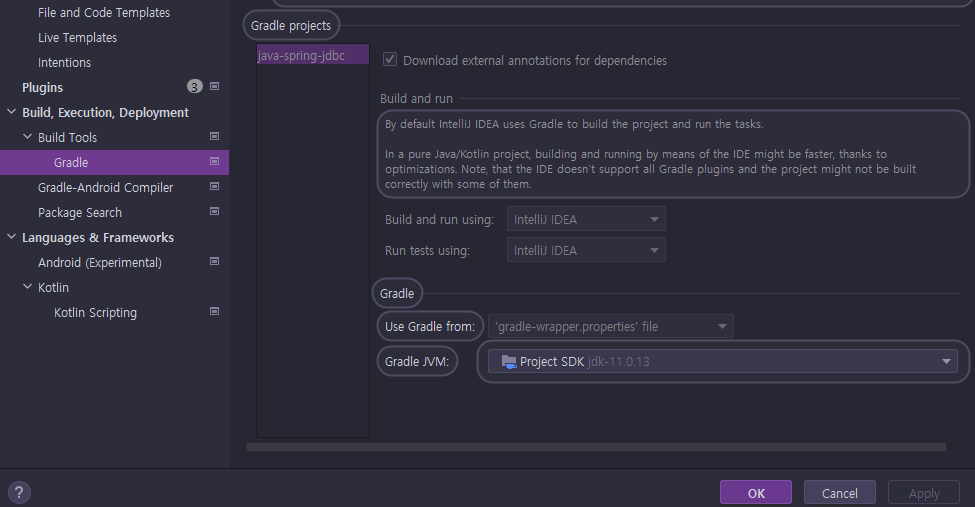
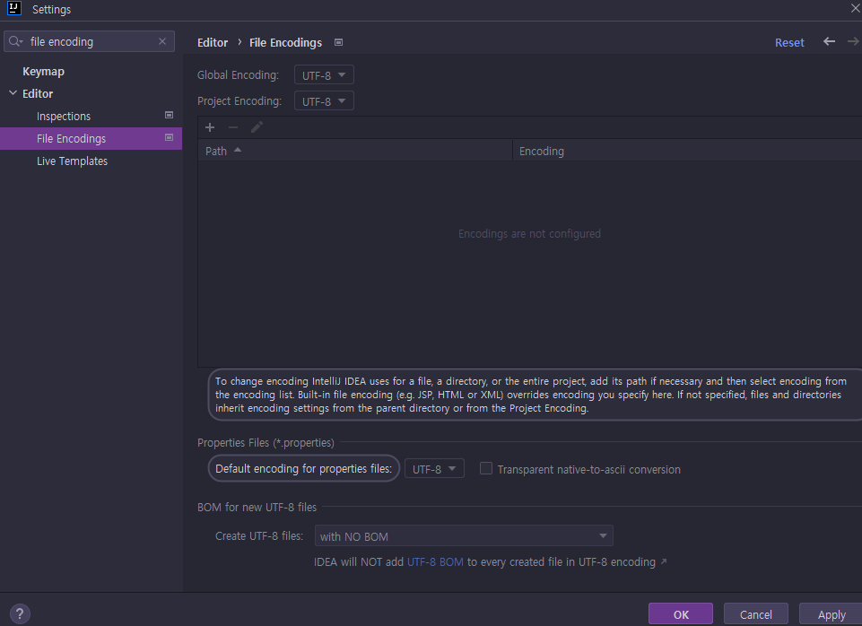

# <a href = "../README.md" target="_blank">스프링 핵심 원리 - 고급편</a>
## Chapter 10. 스프링 AOP 구현
### 10.1 프로젝트 생성
1) 프로젝트 생성
2) `build.gradle`에 라이브러리 추가
3) IDE 설정
4) 실행 확인

---

# 10.1 프로젝트 생성

---

## 1) 프로젝트 생성

### 1.1 사전 준비물
- Java 11 설치
- IDE: IntelliJ 또는 Eclipse 설치

### 1.2 스프링 부트 스타터 사이트로 이동해서 스프링 프로젝트 생성
- https://start.spring.io
- 프로젝트 선택
    - Project: Gradle Project
    - Language: Java
    - Spring Boot: 괄호 안 붙은 버전 (단, 마이너버전이 초반대인 버전은 가급적 지양)
- Project Metadata
    - Group: com.ttasjwi
    - Artifact: aop
    - Name: com.ttasjwi.aop
    - Package name: **com.ttasjwi.aop**
    - Packaging: **jar**
    - Java: 11
- Dependencies: **Spring Aop**

이번에는 스프링 웹 기술은 사용하지 않는다.  
Lombok만 추가하면 된다. 참고로 스프링 프레임워크의 핵심 모듈들은 별도의 설정이 없어도 자동으로 추가된다.  

---

## 2) `build.gradle`에 라이브러리 추가
```groovy
dependencies {
    implementation 'org.springframework.boot:spring-boot-starter-aop' // aop
    
    //테스트에서 lombok 사용
    testCompileOnly 'org.projectlombok:lombok'
    testAnnotationProcessor 'org.projectlombok:lombok'
}
```
- `spring-boot-starter-aop` : Spring-Data 등을 사용할 경우, 의존 라이브러리에 이 역시 포함되어 있는 경우가 많은데
지금 프로젝트에서는 이와 같은 기능을 사용하지 않기 때문에 추가해야한다.
- 테스트 코드에서 lombok을 사용하기 위해 롬복 테스트 관련 설정을 추가해야한다.

---

## 3) IDE 설정

### 3.1 Gradle 기반 실행

- 최근 IntelliJ 버전은 Gradle을 통해서 실행 하는 것이 기본 설정이다. 이렇게 하면 실행속도가 느리다.
- 위와 같이 변경하면 자바로 바로 실행해서 실행속도가 더 빠르다.

### 3.2 롬복 적용

- Preference > plugin > lombok 검색, 실행(재시작)
- Preference > Annotation Processors 검색 > Enable annotation processing 체크 (재시작)
- 임의의 클래스 생성, `@Getter` `@Setter` 확인

### 3.3 파일 인코딩


---

## 4) 실행 확인
- 기본 메인 클래스 실행( `AopApplication.main()` )
- 스프링 부트 실행 로그가 나오면 성공(스프링 웹 프로젝트를 추가하지 않아서 서버가 실행되지는 않는다.)

---
