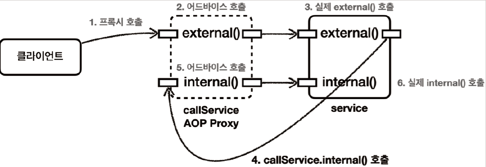

# <a href = "../README.md" target="_blank">스프링 핵심 원리 - 고급편</a>
## Chapter 13. 스프링 AOP - 실무 주의사항
### 13.2 프록시와 내부 호출 - 대안1 자기 자신 주입
1) (실습) 자기 자신을 의존관계 주입
2) 문제점 : setter 사용, 순환 참조

---

# 13.2 프록시와 내부 호출 - 대안1 자기 자신 주입

---

## 1) (실습) 자기 자신을 의존관계 주입
내부 호출을 해결하는 가장 간단한 방법은 자기 자신을 의존관계 주입 받는 것이다.

### 1.1 CallServiceV1
```java
@Slf4j
@Component
public class CallServiceV1 {

    private CallServiceV1 callServiceV1;

    @Autowired
    public void setCallServiceV1(CallServiceV1 callServiceV1) {
        log.info("callServiceV1 setter={}", callServiceV1.getClass()); // 생성자를 통한 초기화 이후 setter로 프록시 주입
        this.callServiceV1 = callServiceV1;
    }

    public void external() {
        log.info("call external");
        callServiceV1.internal(); // 외부 메서드 호출
    }

    public void internal() {
        log.info("call internal");
    }
}
```
- `callServiceV1` 를 수정자(setter)를 통해서 주입 받는 것을 확인할 수 있다. 스프링에서 AOP가 적용된 대상을
의존관계 주입 받으면 주입 받은 대상은 실제 자신이 아니라 프록시 객체이다.
- `external()` 을 호출하면 `callServiceV1.internal()` 를 호출하게 된다. 주입받은 `callServiceV1` 은
프록시이다. 따라서 프록시를 통해서 AOP를 적용할 수 있다.
- 참고로 이 경우 생성자 주입시 오류가 발생한다. 본인을 생성하면서 주입해야 하기 때문에 순환 사이클이
만들어진다. 반면에 수정자 주입은 스프링 빈이 생성된 이후에 주입할 수 있기 때문에 오류가 발생하지 않는다. (생성, 수정자 주입의 단계가 분리되어 있음)

### 1.2 SpringBoot 2.6 이후 : 설정 추가
```shell
Error creating bean with name 'callServiceV1': Requested bean is currently in creation: Is there an unresolvable circular reference?
```
- 스프링 부트 2.6부터는 순환 참조를 기본적으로 금지하도록 정책이 변경되었다. 따라서 이번 예제를 스프링
부트 2.6 이상의 버전에서 실행하면 다음과 같은 오류 메시지가 나오면서 정상 실행되지 않는다.
- 이 문제를 해결하려면 application.properties 에 다음을 추가해야 한다. 앞으로 있을 다른 테스트에도 영향을 주기 때문에 스프링 부트 2.6 이상이라면 이 설정을 꼭 추가해야 한다.
  ```properties
  # Spring Boot 2.6 이후부터는 순환참조를 금지하고, 순환참조 시 로딩 시점에 예외 발생
  # 이 옵션을 주면 순환 참조가 가능해진다.
  spring.main.allow-circular-references=true
  ```

### 1.3 실행 코드
```java
@Slf4j
@Import(CallLogAspect.class)
@SpringBootTest
class CallServiceV1Test {

    @Autowired CallServiceV1 callServiceV1;

    @Test
    void external() {
        callServiceV1.external();
    }

}
```

### 1.4 실행 결과
```shell
aop=void com.ttasjwi.aop.internalcall.CallServiceV1.external()
call external
aop=void com.ttasjwi.aop.internalcall.CallServiceV1.internal()
call internal
```


실행 결과를 보면 이제는 `internal()` 을 호출할 때 자기 자신의 인스턴스를 호출하는 것이 아니라 프록시
인스턴스를 통해서 호출하는 것을 확인할 수 있다. 당연히 AOP도 잘 적용된다.

---

## 2) 문제점 : setter 사용, 순환 참조
- setter 주입을 사용하는 것이 부자연스럽다. 또, 테스트 상황 시, 유연하지 못 하다.
- 순환참조는 스프링 부트 2.6 이후 기준으로 기본적으로 금지되었다.

---
