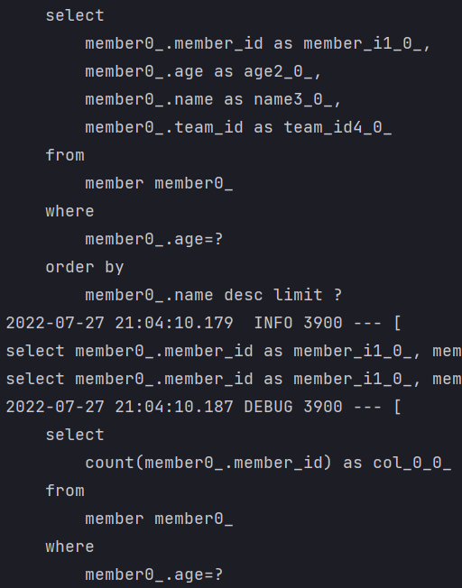

# <a href = "../README.md" target="_blank">실전! 스프링 데이터 JPA</a>
## Chapter 04. 쿼리 메서드 기능
### 4.08 스프링 데이터 JPA 페이징과 정렬
1) 페이징/정렬 관련 파라미터, 반환타입 (Spring Data)
2) (실습) Page 및 Slice 사용 예제
3) Page 및 Slice 인터페이스
4) Page로 가져올 때 count 쿼리가 같이 날아간다.
5) 성능 최적화를 위해 count 쿼리를 별도로 분리할 것
6) 페이지를 유지하면서 엔티티를 DTO로 변환하기(map)
7) 메서드 명에서 Top, First 키워드 사용 페이징

---

# 4.08 스프링 데이터 JPA 페이징과 정렬

---

## 1) 페이징/정렬 관련 파라미터, 반환타입 (Spring Data)
```java
Page<Member> findByUsername(String name, Pageable pageable); // 페이징 o, count 쿼리 사용, 부가 기능
Slice<Member> findByUsername(String name, Pageable pageable); // 페이징 o, count 쿼리 사용 안함, 부가 기능
List<Member> findByUsername(String name, Pageable pageable); // 페이징 o, count 쿼리 사용 안 함, 부가 기능 x
List<Member> findByUsername(String name, Sort sort); // 페이징 x, count 쿼리 사용 안 함, 부가 기능 x
```
Spring Data(RDBMS, NOSQL(MongoDB, ...), ...) 전반에서 공통적으로 사용할 수 있음.

### 1.1 페이징, 정렬에 사용되는 파라미터
- Pageable : 페이징 기능 (내부에 Sort 포함)
  - `org.springframework.data.domain.Pageable`
- Sort : 정렬 기능
  - `org.springframework.data.domain.Sort`

### 1.2 페이징의 반환타입
- Page : 추가 count 쿼리 결과를 포함하는 페이징
  - `org.springframework.data.domain.Page`
  - count : 전체 데이터 갯수
- Slice : 추가 count 쿼리 없이 다음 페이지만 확인 가능 (내부적으로 limit + 1조회)
  - `org.springframework.data.domain.Slice`
  - 내부적으로 limit + 1만큼을 더 조회해오기 때문에 다음 페이지의 존재 여부를 알 수 있다.
  - 전체 데이터 갯수는 필요 없으나, 스크롤을 내려서 '더보기'를 눌러 다음 데이터를 가져오기 편하도록 사용
- List : 자바 컬렉션 List로 조회. 추가 count 쿼리 없이 결과만 반환  

---

## 2) (실습) Page 및 Slice 사용 예제

### 2.1 페이징/정렬 파라미터 지정
```java
PageRequest pageRequest = PageRequest.of(0, 3, Sort.by(Sort.Direction.DESC, "name"));
```
- PageRequest는 Pagable의 구현체 : `org.springframework.data.domain.PageRequest`
- `PageRequest.of(page, size, sort)`을 통해 페이징, 정렬 방식을 지정
  - page : 현재 페이지 (**0부터 시작**)
  - size : 한 번에 조회할 데이터 수
  - sort : (생략 가능) 정렬 정보

### 2.2 페이징 실사용
```java
int age = 10;
PageRequest pageRequest = PageRequest.of(0, 3, Sort.by(Sort.Direction.DESC, "name"));

// when
Page<Member> page = memberRepository.findByAge(age, pageRequest);

// then
List<Member> content = page.getContent(); // getContent : 데이터 가져오기

assertThat(content).extracting("name").containsExactly("member5", "member4", "member3");
assertThat(content.size()).isEqualTo(3);
assertThat(page.getTotalElements()).isEqualTo(5); // getTotalElements : 전체 데이터 수
assertThat(page.getNumber()).isEqualTo(0); // getNumber : 현재 페이지 번호(0부터 시작)
assertThat(page.getTotalPages()).isEqualTo(2); // getTotalPages : 전체 페이지 수
assertThat(page.isFirst()).isTrue(); // isFirst : 현재 페이지 번호
assertThat(page.hasNext()).isTrue(); // hasNext : 다음 페이지 존재 여부 
assertThat(page.hasPrevious()).isFalse(); // hasPrevious : 이전 페이지 존재 여부
assertThat(page.isLast()).isFalse(); // isLast : 마지막 페이지인지 여부
```
- **(주의) 페이지 번호 : 페이지 번호는 0부터 시작한다.**
- page는 데이터 조회 뿐 아니라 count 쿼리까지 같이 날아간다.
- slice는 데이터 조회만 하지만, limit + 1만큼 조회함으로서 다음 페이지 존재 여부를 확인할 수 있다.
- 매우 다양한 유틸 메서드가 제공됨을 알 수 있다.

---

## 3) Page 및 Slice 인터페이스

### 3.1 Page 인터페이스
```java
public interface Page<T> extends Slice<T> {
    int getTotalPages(); //전체 페이지 수
    long getTotalElements(); //전체 데이터 수
    <U> Page<U> map(Function<? super T, ? extends U> converter); // Page<Dto>로 변환
}
```
- Page 인터페이스는 Slice 인터페이스의 하위 인터페이스이다.
- Slice 인터페이스로 조회해올 경우 위 메서드들을 사용할 수 없다.

### 3.2 Slice 인터페이스
```java
public interface Slice<T> extends Streamable<T> {
  int getNumber(); //현재 페이지 (0부터)
  int getSize(); // 페이지 크기
  int getNumberOfElements(); // 현재 페이지에 나올 데이터 수
  List<T> getContent(); //조회된 데이터
  boolean hasContent(); //조회된 데이터 존재 여부
  Sort getSort(); // 정렬 정보
  boolean isFirst(); //현재 페이지가 첫 페이지 인지 여부
  boolean isLast(); //현재 페이지가 마지막 페이지 인지 여부
  boolean hasNext(); //다음 페이지 여부
  boolean hasPrevious(); //이전 페이지 여부
  Pageable getPageable(); //페이지 요청 정보
  Pageable nextPageable(); //다음 페이지 객체
  Pageable previousPageable();//이전 페이지 객체
  <U> Slice<U> map(Function<? super T, ? extends U> converter); // Slice<Dto>로 변환
}
``` 
- Slice 인터페이스는 Page 인터페이스의 상위 인터페이스

---

## 4) Page로 가져올 때 count 쿼리가 같이 날아간다.

- 전체 count 쿼리는 그 자체만으로도 매우 무겁다.
- page로 조회할 경우 count 쿼리가 같이 날아간다.
- 전체 페이지 갯수가 필요 없는 경우(예: 스크롤 -> 다음 페이지) slice를 고려해볼 것

---

## 5) 성능 최적화를 위해 count 쿼리를 별도로 분리할 것
```java
@Query(value = “select m from Member m”,
    countQuery = “select count(m.username) from Member m”)
Page<Member> findMemberAllCountBy(Pageable pageable);
```
- 전체 count 쿼리는 그 자체만으로도 매우 무겁다.
- `@Query`는 카운트 쿼리를 별도로 작성할 수 있게 해놨다.
- SQL이 복잡해질 경우(조인이 많아질 경우) 사용을 고려
- 보통 카운트를 계산 시 left join 등 다른 join 쿼리를 사용하지 않는 경우가 많기 때문

---

## 6) 페이지를 유지하면서 엔티티를 DTO로 변환하기(map)
```java
Page<Member> page = memberRepository.findByAge(10, pageRequest);
Page<MemberDto> dtoPage = page.map(m -> new MemberDto());
```
- 엔티티를 직접 api로 반환하는 것은 위험하다.
- page, slice 각각은 map 메서드를 통해, 다른 DTO로 변환할 수 있는 기능을 제공함

---

## 7) 메서드 명에서 Top, First 키워드 사용 페이징
```java
User findFirstByOrderByLastnameAsc();
User findTopByOrderByAgeDesc();
Page<User> queryFirst10ByLastname(String lastname, Pageable pageable);
Slice<User> findTop3ByLastname(String lastname, Pageable pageable);
List<User> findFirst10ByLastname(String lastname, Sort sort);
List<User> findTop10ByLastname(String lastname, Pageable pageable);
```
- 메서드 명에 Top, First 키워드를 사용 시 상위 몇 건을 가져올 지 지정하는 편의 기능 제공
  - 예) `findTop3By...()`
- 참고 : https://docs.spring.io/spring-data/jpa/docs/current/reference/html/#repositories.limit-query-result

---
